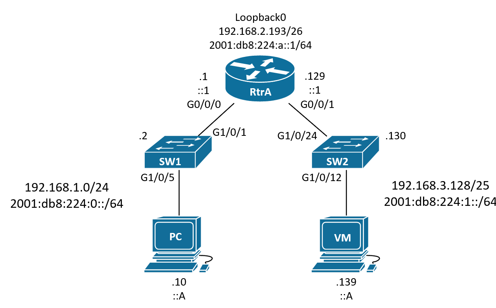
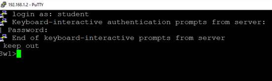
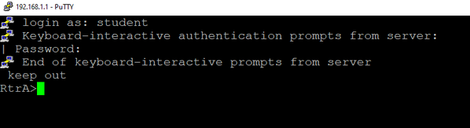
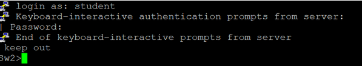
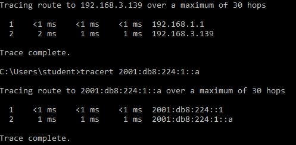
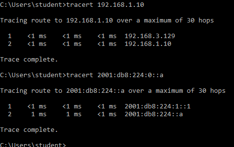
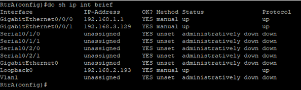

# Cisco Base Configuration

By Trevor Zellmer </br>

Links: </br>
> [cisco](cisco.md) </br>




## Purpose
This is a guide on how to configure a small network with two switches, one router, and two desktops. 
This is the base configuration document that details many commands to use on cisco devices.

## New Commands
   Prompt |   Name of mode     | purpose
----------------|--------------------|------------
Router>         | user exec mode     | the first mode used at login, few privs
Router#         | priv exec mode     | do basic things like ping, ssh, and set the system clock
Router(config)# | global config mode | the mode used to edit most settings on routers or switches
Router(config-line)#| line config mode | sub mode within global, used to edit ssh  and console connections 
Router(config-if)#  | interface config | sub mode within gloabl, used to edit interfaces


#### Priv Exec Mode

  command                 |  purpose 
--------------------------|---------
show running-config       | show the configuration running in ram
copy run start            | save the current running configuration as the startup configuration
config t                  | enter global config mode
reload                    | restart the device
clock set 07:13:00 October 15 2022 | purpose is self evident
ping                      | network troubleshooting
tracert                   | network troubleshooting
ssh |  remote access


#### Global Config Mode
  command                 |  purpose 
--------------------------|---------
line vty 0 15 | enter line config mode to edit ssh
crypto key generate rsa | create a key for ssh
line con 0 | enter line config mode 
interface g0/0/0 | enter interface config mode
hostname R1 | sets the hostname of the device
banner motd "no unauthorized access is allowed" | sets the motd
enable password class | sets password  'class" for restricting access to priv exec mode
enable secret class | sets encrypted password 'class' for restricting access to priv exec
service password-encryption | sets encryption on all passwords
line aux 0 | edit aux zero
no ip domain-lookup | by default cisco devices will try to ping user input if it is invalid. This command prevents that behavior.
copy run start | make the current configuration the new startup configuration
ipv6 unicast-routing | enable ivp6 unicast routing 


#### Line Config Mode
  command                 |  purpose 
--------------------------|---------
password cisco | enter the terminal pasword
login | enter for configuration
logging sync | by default cisco devices output logging information that interrupts user input. This command prevents the interruptions.
transport input ssh | allows remote access on this vty
exec-time 120 0 | by default cisco devices have a timer that closes the sessions of AFK users. This command sets the timer to 120 minutes.

#### Interface Config Mode
  command                 |  purpose 
--------------------------|---------
interface g0/0/0          | configure interface on router 
ip add fe80::1 link-local | add link local address
interface vlan1 | configure interface on switch
desc S1 | description
ip address 192.168.1.1 255.255.255.0 | configure ipv4 addresses on switches or routers
ipv6 add 2001:db8:224:0::1/64 | configure ipv6 addresses on routers
no shutdown               | turn on the interface


## Universal Configuration
The commands below will be used on every cisco device to enable SSH, set hostnames, and configure domain names.
These are the first commands that should be run on a cisco router or switch.

1. enter user exec mode: **enable**
2. enter global exec mode: **config t**
3. set the device hostname: **hostname exampleName**
4. enter console line zero: **line con 0**
5. set the password for global exec mode: **password cisco**
6. type: **login**
7. create a password for user exec mode: **enable secret class**
8. set the domain name: **ip domain name challenge.local**
9. encrypt any plain text passwords: **service password-encryption**
10. Generate a key for SSH useage: **crypto key generate rsa**
11. When prompted for the encryption bits type: **1024**
12. specify the use of ssh version 2 by typing: **ip ssh ver 2**
13. create a user and specify their 'secret' password: **username student secret cisco** 
14. create an admin user and specify their privelges: **username admin priv 15 secret cisco**
15. select virtual terminal lines: **line vty 0 15**
16. enable ssh on the selected virtual terminal lines: **transport input ssh**
17. use the local database for authentication: **login local**
18. create a message for all who enter the network, including tresspassers: **banner motd % keep out %**


# Router Configuration Procedure
1. Get a computer with PuTTY installed. Plug a console cable into it's eithernet port; plug the other end into the router's console port.
</br>


2. Open the router on PuTTY and enter all of the universal configuration commands found above. Set the hostname to RtrA and the domain name to challenge.local during this process.
</br>


3. Set up ipv6 routing and secure the auxillary port using these commands:
>   a. select aux zero for editing: **line aux 0** </br>
>    b. set the password for the line: **password cisco** </br>
>    c. log into the line: **login** </br>
>    d. enable ipv6: **ipv6 unicast-routing** </br>
</br>

4. Set up each router interface on the table below using the following commands:


Interface | Ipv4 | Ipv6 | link-local | Description
----------|-------------------------------|----------------|------------------|-------
g0/0/0 | 192.168.1.1 255.255.255.0 | `2001:db8:224:0::1/64` | FE80::1 link-local | Connect to Sw1
g0/0/1 | 192.168.3.129 255.255.255.128 | `2001:db8:224:1::1/64` | FE80::1 link-local | Connect to Sw2
loopback0 | 192.168.2.193 255.255.255.192 | `2001:db8:224:a::1/64` | FE80::1 link-local | Virtual Int

>a. Select the interface for editing: **int g0/0/0** </br>
>b. Set a suitable description: **desc Connect to Sw1** </br>
>c. Set the ipv4 address:  **ip add 192.168.1.1 255.255.255.0** </br>
>d. Set the ipv6 address: **ipv6 add 2001:db8:224:0::1/64** </br>
>e. Set the link local address: **ipv6 add FE80::1 link-local** </br>
>f. Turn the interace on: **no shut** </br>
>g. Exit the interface: **exit** </br>

5. Connect a yellow patch cable to g0/0/0 on the router, connect the other end to g1/0/1 on switch1.
6. Connect another yellow patch cable to g0/0/1 on the router, connect the other end to g1/0/24 on switch2.
7. Connect a yellow patch cable to g1/0/5 on switch1, connect the other end to the nic on Pc1.
8. Connect a yellow patch cable to g1/0/12 on switch2, connect the other end to the nic on Pc2.

9. Configure switch1 using the following instructions:
>a. Pull the console cable out of the router and put it into switch1. </br>
>b. Console into switch 1 with PuTTY. </br>
>c. Execute the [universal configuration](#universal-configuration) commands found above on switch1 and set the hostname to Sw1. </br>
>d. Set the default gateway: **ip default-gateway 192.168.1.1** </br>
>e. Select an interface to setup: **int vlan1** </br>
>f. Set the ipv4 address: **ip address 192.168.1.2 255.255.255.0** </br>
>g. Turn the interface on : **no shut** </br>


10. Configure switch2 using the following instructions:
>a. Pull the console cable out of Sw1 and put it into switch2. </br>
>b. Console into switch 2 with PuTTY. </br>
>c. Execute the [universal configuration](#universal-configuration) commands found above on switch 2. </br>
>d. Set the default gateway: **ip default-gateway 192.168.3.129** </br>
>e. Select an interface to setup: **int vlan1** </br>
>f. Set the ipv4 address: **ip address 192.168.3.130 255.255.255.128** </br>
>g. Turn the interface on : **no shut** </br>

11. Configure the Ip addresses on  Pc1 and Pc2. Edit their firewalls to allow access.

Device | Ipv4 | Ipv4 Gateway | Ipv6 | Ipv6 Gateway
-------|---------------|--------|--------|---------
Pc1 | 192.168.1.10 | 192.168.1.1 255.255.255.0 | `2001:db8:224:0::a/64` | `2001:db8:224:0::1`
Pc2 | 192.168.3.139 | 192.168.3.129 255.255.255.128 | `2001:db8:224:1::a/64` | `2001:db8:224:1::1`

# Verification and Troubleshooting


1. look at all of the physical connections and verify all of the cables are in the correct places.


2. Test SSH on Sw1
>a. Open putty on Pc1 and select SSH mode </br>
>b. SSH into Sw1, which has the IP address 192.168.1.2


3. Test SSH on RtrA
>a. Open putty on Pc1 and select SSH mode </br>
>b. SSH into RtrA, which has the IP address 192.168.1.1


4. Test SSH on Sw2
>a. Open putty on Pc1 and select SSH mode </br>
>b. SSH into Sw2 , which has the IP address 192.168.3.130



5. Traceroute from pc2 from pc1.
>a. On the commandline of Pc1 type: **tracert 192.168.3.139** </br>
>b. On the commandline of Pc1 type: **tracert 2001:db8:224:1::a** </br>
>c. If the traceroute failed take note of where it failed.


6. Traceroute from pc1 from pc2.
>a. On the commandline of Pc2 type: **tracert 192.168.1.10** </br>
>b. On the commandline of Pc2 type: **tracert 2001:db8:224:0::a** </br>
>c. If the traceroute failed take note of where it failed.


7. Console into the problematic device and look for issues.

>a. Enter user exec mode: **en** </br>
>b. Enter global exec mode: **conf t** </br>
>c. Display the current interface configuration: **sh ip int brief** </br>
>d. repair any misconfigurations that do not match the instructions above </br>


8. If you cannot figure out what is wrong with the device, wipe it and retype all of the commands.
>a. Enter user exec mode: **en** </br>
>b. Enter global exec mode: **conf t** </br>
>c. Wipe the device to factory settings:  **write erase** </br>
>d. Reboot the device so that the changes take effect: **reload** </br>
>e. Refer to the instructions above for configuring each device on the network.


<details> <summary> configuration scripts</summary>

```
! ===============================
! This is switch 1 config
en
config t
hostname Sw1
no ip domain-lookup
line con 0
password cisco
login
logging sync
exec-time 120 0
enable secret class
service password-encryption
ip domain name challenge.local
crypto key generate rsa
1024
ip ssh ver 2
username student secret cisco
username admin priv 15 secret cisco
line vty 0 15
transport input ssh
login local
banner motd % keep out %
ip default-gateway 192.168.1.1
int vlan1
ip address 192.168.1.2 255.255.255.0
no shut
exit
!copy run start
!show arp
!show run


! ===============================
! This is switch 2 config
en
config t
hostname Sw2
no ip domain-lookup
line con 0
password cisco
login
logging sync
exec-time 120 0
enable secret class
service password-encryption
ip domain name challenge.local
crypto key generate rsa
1024
ip ssh ver 2
username student secret cisco
username admin priv 15 secret cisco
line vty 0 15
transport input ssh
login local
banner motd % keep out %
ip default-gateway 192.168.3.129
int vlan1
ip address 192.168.3.130 255.255.255.128
no shut
exit
!copy run start
!show arp
!show run


! ================================
! This is a generic router config
en
config t
hostname RtrA
no ip domain-lookup
line con 0
password cisco
login
logging sync
enable secret class
service password-encryption
ip domain name challenge.local
crypto key generate rsa
1024
ip ssh ver 2
username student secret cisco
username admin priv 15 secret cisco
line vty 0 15
transport input ssh
login local
banner motd % keep out %
! commands below this point are unqiue to routers
line aux 0
password cisco
login
ipv6 unicast-routing
int g0/0/0
desc Connect to Sw1
ip add 192.168.1.1 255.255.255.0
ipv6 add 2001:db8:224:0::1/64
ipv6 add FE80::1 link-local
no shut
int g0/0/1
desc Connect to Sw2
ip add 192.168.3.129 255.255.255.128
ipv6 add 2001:db8:224:1::1/64
ipv6 add FE80::1 link-local
no shut
int loopback0
ip add 192.168.2.193 255.255.255.192
desc Virtual Interface
ipv6 add 2001:db8:224:a::1/64
ipv6 add FE80::1 link-local
no shut
```

</summary> </details>

