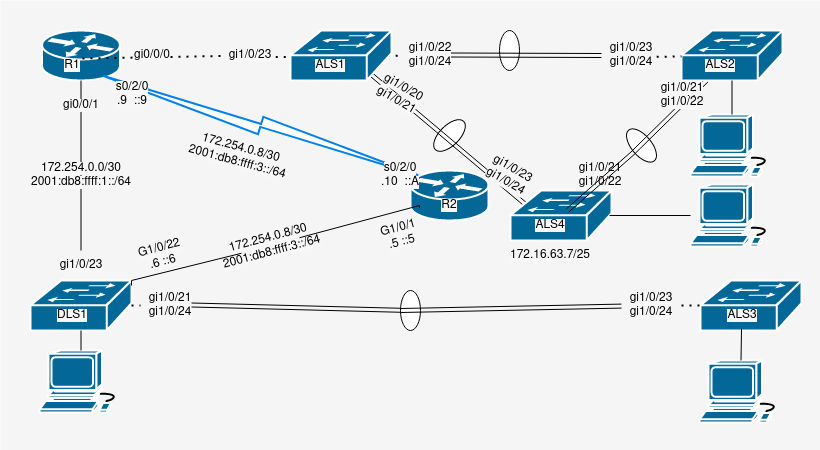
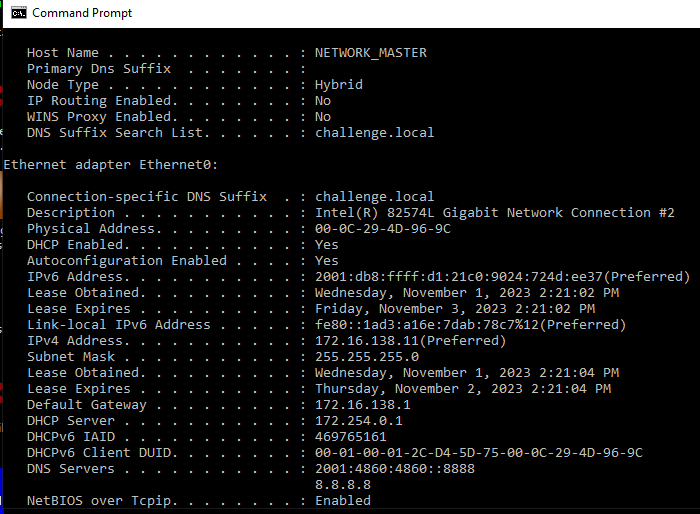
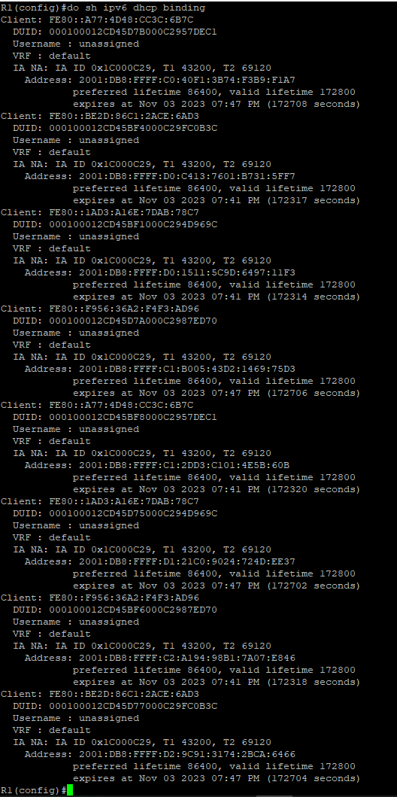
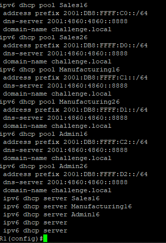

# Cisco DHCP
by Trevor Zellmer </br>

Links:
> [cisco](cisco.md) </br>
> [cisco-dhcp](cisco-dhcp.md) </br>


## Purpose:
DHCPv6 does the same thing as DHCP but with ipv6. The way the protocols function is actually quite a bit different.


- Stateless DHCP is when the router does not maintain a list of bindings
- Stateful DHCP gets all DHCP assignments from a server
- DHCPv6 is controlled using flags
- The 'm' flag specifies the use of a stateful ipv6 dhcp setup
- The 'o' flag is used in conjuction with a stateless ipv6 dhcp client
- The 'A' flag specifies the use of ipv6 autoconfiguration. Client's make up their own ipv6 address with    slaac.

## New Commands
New Command | what it [does](does.md)
------------|-------------
sh ipv6 dhcp binding | display useful dhcp information
debug ipv6 dhcp | enter debug mode
ipv6 dhcp pool examplePool | create ipv6 dhcp pool
dns-server 2001:db8:acad::254 | set dns server for the pool
domain-name example.com | set the pool domain name
(config-if) ipv6 dhcp server r1 STATELESS | create stateless pool
(config-if) ipv6 dhcp pool R2 STATEFUL | create stateful pool
(config-if) ipv6 nd prefix default no-autoconfig | disable the stateless ipv6 client self-configuration
(config-if) ipv6 nd other-config-flag | Get other (non address) DHCP info from a stateless DHCPv6 server
(config-if) ipv6 nd managed-config-flag | Set the interface to use stateful DHCPv6
(config-if) ipv6 dhcp relay destination 2001:db8:acad:2::1 g0/0/0 | specify relay destination
(config-if) ipv6 dhcp server automatic | set interface to automatically assign pool based on relay address


## Procedure
1. Set up network cables using this diagram

 

2. On DLS1, forward DHCPv6 to router 1 on every vlan.
- a. Edit the vlan: **int vlan 128**
- b. Disable stateless settings: **ipv6 nd prefix default no-autoconfig**
- d. Make the vlan stateful: **ipv6 nd managed-config-flag**
- e. Forward DHCP traffic to R1: **ipv6 dhcp relay destination 2001:db8:acad:0::1**


3. On r1, configure interfaces to communicate with DLS1
- a. Edit the interface: **int g0/0/1**
- b. Assign DHCPv6 pool based on relay address: **ipv6 dhcp server automatic**
- c. Edit the interface: **int s0/2/0**
- d. Assign DHCPv6 pool based on relay address: **ipv6 dhcp server automatic**


4. On r1, create a DHCPv6 pool for each vlan on the DLS1 network
- a. Create a pool: **ipv6 dhcp pool Sales26**
- b. Set the prefix of the pool: **address prefix 2001:db8:ffff:d0::/64**
- c. Set the DNS server of the pool: **dns-server 2001:4860:4860::8888**
- d. Set the domain name of the pool: **domain-name challenge.local**


5. On r1, create a DHCPv6 pool for each vlan on the r1 network.
- a. Create a pool: **ipv6 dhcp pool Sales16**
- b. Set the address prefix:  **address prefix 2001:db8:ffff:c0::/64**
- c. Set the DNS server:  **dns-server 2001:4860:4860::8888**
 -d. Set the domain name: **domain-name challenge.local**

6. On r1, edit each subinterface to be stateful
- a. Configure the subinterface: **int gi0/0/0.33**
- b. Set the DHCP server of the interface: **ipv6 dhcp server Sales16**
- c. Disable address autoconfiguration: **ipv6 nd prefix default no-autoconfig**
- d. Make the vlan stateful: **ipv6 nd managed-config-flag**


## Troubleshooting and Verification

1. Verify functional DHCPv6 on a PC
- a. View address assignment: **ipconfig /all**
- b. Ensure your result is similar to the image below



2. Verify R1 DHCPv6 bindings
- a. Display DHCP bindings: **sh ipv6 dhcp bindings**
- b. Ensure your bindings look similar



3. Verify R1 DHCPv6 bindings
- a. Verify DHCP configuraiton: **sh run | section dhcp**
- b. Ensure your configuration looks similar to that below




4. If you cannot figure out what is wrong with a device, wipe it and retype all of the commands.
- a. Enter user exec mode: **en** </br>
- b. Enter global exec mode: **conf t** </br>
- c. Wipe the device to factory settings:  **write erase** </br>
- d. Reboot the device so that the changes take effect: **reload** </br>
- e. Refer to the instructions above for configuring each device on the network.


<details> <summary>Script</summary>


```
! ===============================
! This is switch 1 config
en
config t
hostname ALS1
no ip domain-lookup
line con 0
password cisco login
logging sync
exec-time 120 0
enable secret class
service password-encryption
ip domain name challenge.local
crypto key generate rsa
1024
ip ssh ver 2
username student secret cisco 
username admin priv 15 secret cisco 
line vty 0 15
transport input ssh
login local
banner motd % keep out %
ip default-gateway 172.16.63.1
vlan 33
name Sales
exit
vlan 44
name Manufacturing
exit
vlan 55
name Admin
exit
vlan 63
name ITmgmt
exit
vlan 888
name NativeONLY
exit
int range gi1/0/1-8
switchport mode access
switchport access vlan 33
no shut
exit
int range gi1/0/9-12
switchport mode access
switchport access vlan 44
no shut
exit
int range gi1/0/13-18
switchport mode access
switchport access vlan 55
no shut
exit
int vlan 63
ip add 172.16.63.5 255.255.255.128
desc ITmgmt
no shut
exit
int range gi1/0/20-21
shut
channel-group 2 mode desir
int po2
shut
desc connect to ALS4
!switchport trunk encapsulation dot1q
switchport nonegotiate
switchport mode trunk
switchport trunk allowed vlan 33,44,55,63
switchport trunk native vlan 888
no shut
exit
int gi1/0/23
!switchport trunk encapsulation dot1q
switchport nonegotiate
switchport mode trunk
switchport trunk allowed vlan 33,44,55,63
switchport trunk native vlan 888
no shut
exit
int range gi1/0/24, gi1/0/22
shut
channel-group 1 mode active
int po1
shut
!switchport trunk encapsulation dot1q
switchport nonegotiate
switchport mode trunk
switchport trunk allowed vlan 33,44,55,63
switchport trunk native vlan 888
no shut
exit
spanning-tree mode rapid-pvst
spanning-tree portfast default
spanning-tree portfast bpduguard default
spanning-tree vlan 33 root primary
spanning-tree vlan 44 root primary
spanning-tree vlan 55 root secondary
spanning-tree vlan 63 root secondary
ip access-list standard BlockSales
 remark Block R1 Sales network
 deny   172.16.33.0 0.0.0.255
 remark Block 3750-2 Sales network
 deny   172.16.128.0 0.0.0.255
 permit any
line vty 0 15
 access-class BlockSales in
!copy run start
!show arp
!show run


! ===============================
! This is switch 2 config
en
config t
hostname ALS2
no ip domain-lookup
line con 0
password cisco
login
logging sync
exec-time 120 0
enable secret class
service password-encryption
ip domain name challenge.local
crypto key generate rsa
1024
ip ssh ver 2
username student secret cisco 
username admin priv 15 secret cisco
line vty 0 15
transport input ssh
login local
banner motd % keep out %
ip default-gateway 172.16.63.1
vlan 33
name Sales
exit
vlan 44
name Manufacturing
exit
vlan 55
name Admin
exit
vlan 63
name ITmgmt
exit
vlan 888
name NativeONLY
exit
int range gi1/0/1-6
switchport mode access
switchport access vlan 33
no shut
exit
int range gi1/0/7-14
switchport mode access
switchport access vlan 44
no shut
exit
int range gi1/0/15-20
switchport mode access
switchport access vlan 55
no shut
exit
int vlan 63
ip add 172.16.63.6 255.255.255.128
desc ITmgmt
no shut
exit
int range gi1/0/23-24
shut
channel-group 1 mode active
int po1
shut
!switchport trunk encapsulation dot1q
switchport nonegotiate
switchport mode trunk
switchport trunk allowed vlan 33,44,55,63
switchport trunk native vlan 888
no shut
exit
int range gi1/0/21-22
shut
channel-group 2 mode active
int po2
shut
desc Connect to ALS4
!switchport trunk encapsulation dot1q
switchport nonegotiate
switchport mode trunk
switchport trunk allowed vlan 33,44,55,63
switchport trunk native vlan 888
no shut
exit
spanning-tree mode rapid-pvst
spanning-tree portfast default
spanning-tree portfast bpduguard default
ip access-list standard BlockSales
 remark Block R1 Sales network
 deny   172.16.33.0 0.0.0.255
 remark Block 3750-2 Sales network
 deny   172.16.128.0 0.0.0.255
 permit any
line vty 0 15
 access-class BlockSales in
!sh ip trunk brief
!sh vlan brief
!copy run start
!show arp
!show run

! ===============================
! This is ALS3 config
en
config t
hostname ALS3
no ip domain-lookup
line con 0
password cisco
login
logging sync
exec-time 120 0
enable secret class
service password-encryption
ip domain name challenge.local
crypto key generate rsa
1024
ip ssh ver 2
username student secret cisco 
username admin priv 15 secret cisco
line vty 0 15
transport input ssh
login local
banner motd % keep out %
ip default-gateway 172.16.153.1
vlan 128
name Sales
exit
vlan 138
name Manufacturing
exit
vlan 148
name Admin
exit
vlan 153
name ITmgmt
exit
vlan 999
name NativeONLY
exit
int range gi1/0/1-8
switchport mode access
switchport access vlan 128
no shut
exit
int range gi1/0/9-12
switchport mode access
switchport access vlan 138
no shut
exit
int range gi1/0/13-18
switchport mode access
switchport access vlan 148
no shut
exit
int vlan 153
ip add 172.16.153.6 255.255.255.128
desc ITmgmt
no shut
exit
int range gi1/0/23-24
shut
channel-group 1 mode desir
int po1
shut
desc Connect to DLS1
!sdm prefer dual-ipv4-and-ipv6 default
!switchport trunk encapsulation dot1q
switchport nonegotiate
switchport mode trunk
switchport trunk allowed vlan 128,138,148,153
switchport trunk native vlan 999
no shut
exit
spanning-tree mode rapid-pvst
spanning-tree portfast default
spanning-tree portfast bpduguard default
ip access-list standard BlockSales
 remark Block R1 Sales network
 deny   172.16.33.0 0.0.0.255
 remark Block 3750-2 Sales network
 deny   172.16.128.0 0.0.0.255
 permit any
line vty 0 15
 access-class BlockSales in
!sh ip trunk brief
!sh vlan brief
!copy run start
!show arp
!show run


! ===============================
! This is switch 4 config
en
config t
hostname ALS4
no ip domain-lookup
line con 0
password cisco
login
logging sync
exec-time 120 0
enable secret class
service password-encryption
ip domain name challenge.local
crypto key generate rsa
1024
ip ssh ver 2
username student secret cisco 
username admin priv 15 secret cisco
line vty 0 15
transport input ssh
login local
banner motd % keep out %
ip default-gateway 172.16.63.1
vlan 33
name Sales
exit
vlan 44
name Manufacturing
exit
vlan 55
name Admin
exit
vlan 63
name ITmgmt
exit
vlan 888
name NativeONLY
exit
int range gi1/0/1-6
switchport mode access
switchport access vlan 33
no shut
exit
int range gi1/0/7-14
switchport mode access
switchport access vlan 44
no shut
exit
int range gi1/0/15-22
switchport mode access
switchport access vlan 55
no shut
exit
int vlan 63
ip add 172.16.63.7 255.255.255.128
desc ITmgmt
no shut
exit
int range gi1/0/23-24
shut
channel-group 1 mode desir
int po1
shut
desc Connect to ALS1
!switchport trunk encapsulation dot1q
switchport nonegotiate
switchport mode trunk
switchport trunk allowed vlan 33,44,55,63
switchport trunk native vlan 888
no shut
exit
int range gi1/0/21-22
shut
channel-group 2 mode active
int po2
shut
desc Connect to ALS2
!switchport trunk encapsulation dot1q
switchport nonegotiate
switchport mode trunk
switchport trunk allowed vlan 33,44,55,63
switchport trunk native vlan 888
no shut
exit
spanning-tree mode rapid-pvst
spanning-tree portfast default
spanning-tree portfast bpduguard default
spanning-tree vlan 63 root primary
spanning-tree vlan 55 root primary
spanning-tree vlan 33 root secondary
spanning-tree vlan 44 root secondary
ip access-list standard BlockSales
 remark Block R1 Sales network
 deny   172.16.33.0 0.0.0.255
 remark Block 3750-2 Sales network
 deny   172.16.128.0 0.0.0.255
 permit any
line vty 0 15
 access-class BlockSales in
!sh ip trunk brief
!sh vlan brief
!copy run start
!show arp
!show run


! ===============================
! This is DLS1 config
en
config t
hostname DLS1
no ip domain-lookup
line con 0
password cisco
login
logging sync
exec-time 120 0
enable secret class
service password-encryption
ip domain name challenge.local
crypto key generate rsa
1024
ip ssh ver 2
username student secret cisco 
username admin priv 15 secret cisco
line vty 0 15
transport input ssh
login local
banner motd % keep out %
ip default-gateway 172.254.0.1
ip routing
!sdm prefer dual-ipv4-and-ipv6 default
ipv6 unicast-routing
do copy run start

!---- DLS1 part 2 of commands ----

vlan 138
name Sales
exit
vlan 138
name Manufacturing
vlan 148
name Admin
vlan 153
name ITmgmt
vlan 999
name NativeONLY
exit
int vlan 128
ip add 172.16.128.1 255.255.255.0
ipv6 add 2001:db8:ffff:d0::1/64
ipv6 add FE80::A link-local
ip helper-address 192.168.150.1
exit
int vlan 138
ip add 172.16.138.1 255.255.255.0
ipv6 add 2001:db8:ffff:d1::1/64
ipv6 add FE80::A link-local
ip helper-address 192.168.150.1
exit
int vlan 148
ip add 172.16.148.1 255.255.255.0
ipv6 add 2001:db8:ffff:d2::1/64
ipv6 add FE80::A link-local
ip helper-address 192.168.150.1
exit
int vlan 153
ip add 172.16.153.1 255.255.255.0
ip helper-address 192.168.150.1
exit
int range gi1/0/1-8
switchport mode access
switchport access vlan 128
no shut
exit
int range gi1/0/9-12
switchport mode access
switchport access vlan 138
no shut
exit
int range gi1/0/13-18
switchport mode access
switchport access vlan 148
no shut
exit
int gi1/0/22
no switchport
ip add 172.254.0.6 255.255.255.252
ipv6 add 2001:db8:ffff:2::6/64
ipv6 add FE80::A link-local
no shut
int gi1/0/23
no switchport
ip add 172.254.0.2 255.255.255.252
ipv6 add 2001:db8:ffff:1::2/64
ipv6 add FE80::A link-local
no shut
int vlan 153
ip add 172.16.153.1 255.255.255.128
desc ITmgmt
no shut
exit
int range gi1/0/21, gi1/0/24
shut
channel-group 1 mode desir
int po1
shut
desc Connect to ALS3
!switchport trunk encapsulation dot1q
switchport nonegotiate
switchport mode trunk
switchport trunk allowed vlan 128,138,148,153
switchport trunk native vlan 999
no shut
exit
!sh ip trunk brief
!sh vlan brief
!copy run start
!show arp
!show run
!Step 6a & b
ip route 172.16.33.0 255.255.255.0 172.254.0.1
ipv6 route 2001:db8:ffff:c0::/64 2001:db8:ffff:1::1
ip route 172.16.33.0 255.255.255.0 172.254.0.5 16
ipv6 route 2001:db8:ffff:c0::/64 2001:db8:ffff:2::5 16
ip route 172.16.44.0 255.255.255.0 172.254.0.1
ipv6 route 2001:db8:ffff:c1::/64 2001:db8:ffff:1::1
ip route 172.16.44.0 255.255.255.0 172.254.0.5 16
ipv6 route 2001:db8:ffff:c1::/64 2001:db8:ffff:2::5 16
ip route 172.16.55.0 255.255.255.0 172.254.0.1
ipv6 route 2001:db8:ffff:c2::/64 2001:db8:ffff:1::1
ip route 172.16.55.0 255.255.255.0 172.254.0.5 16
ipv6 route 2001:db8:ffff:c2::/64 2001:db8:ffff:2::5 16
ip route 172.16.63.0 255.255.255.0 172.254.0.1
ip route 172.16.63.0 255.255.255.0 172.254.0.5 16
!Step 6c & d
ip route 172.254.0.8 255.255.255.252 172.254.0.1
ipv6 route 2001:db8:ffff:3::/64 2001:db8:ffff:1::1
ip route 172.254.0.8 255.255.255.252 172.254.0.5 32
ipv6 route 2001:db8:ffff:3::/64 2001:db8:ffff:2::5 32
!Step 6e & f
ip route 192.168.150.1 255.255.255.255 172.254.0.1
ipv6 route 2001:db8:acad:0::1/128 2001:db8:ffff:1::1
ip route 192.168.150.1 255.255.255.255 172.254.0.5 64
ipv6 route 2001:db8:acad:0::1/128 2001:db8:ffff:2::5 64
spanning-tree mode rapid-pvst
spanning-tree portfast default
spanning-tree portfast bpduguard default
ip access-list standard BlockSales
spanning-tree vlan 128 root primary
spanning-tree vlan 138 root primary
spanning-tree vlan 148  root primary 
spanning-tree vlan 153 root primary
ip access-list standard BlockSales
 remark Block R1 Sales network
 deny   172.16.33.0 0.0.0.255
 remark Block 3750-2 Sales network
 deny   172.16.128.0 0.0.0.255
 permit any
line vty 0 15
 access-class BlockSales in
ipv6 access-list BlockV6Sales
 remark Block R1 Sales IPv6 network
 deny   ipv6 2001:db8:ffff:c0::/64 any
 remark Block 3750-2 IPv6 network
 deny   ipv6 2001:db8:ffff:d0::/64 any
 permit ipv6 any any
line vty 0 15
 ipv6 access-class BlockV6Sales in
int vlan 128
ipv6 nd prefix default no-autoconfig
ipv6 nd managed-config-flag
ipv6 dhcp relay destination 2001:db8:acad:0::1
int vlan 138
ipv6 nd prefix default no-autoconfig
ipv6 nd managed-config-flag
ipv6 dhcp relay destination 2001:db8:acad:0::1
int vlan 148
ipv6 nd prefix default no-autoconfig
ipv6 nd managed-config-flag
ipv6 dhcp relay destination 2001:db8:acad:0::1
exit


! ================================
! This is router 1 config
en
config t
hostname R1
no ip domain-lookup
line con 0
password cisco
login
logging sync
enable secret class
service password-encryption
ip domain name challenge.local
crypto key generate rsa
1024
ip ssh ver 2
username student secret cisco
username admin priv 15 secret cisco
line vty 0 15
transport input ssh
login local
banner motd % keep out %
! commands below this point are unqiue to routers
line aux 0
password cisco
login
ipv6 unicast-routing
!-- Make Subinterfaces
int gi0/0/0.33
encapsulation dot1q 33
ip address 172.16.33.1 255.255.255.0
ipv6 add 2001:db8:ffff:c0::1/64
ipv6 add FE80::1 link-local
int gi0/0/0.44
encapsulation dot1q 44
ip add 172.16.44.1 255.255.255.0
ipv6 add 2001:db8:ffff:c1::1/64
ipv6 add FE80::1 link-local
int gi0/0/0.55
encapsulation dot1q 55
ip address 172.16.55.1 255.255.255.0
ipv6 add 2001:db8:ffff:c2::1/64
ipv6 add FE80::1 link-local
int gi0/0/0.63
encapsulation dot1q 63
ip address 172.16.63.1 255.255.255.0
ipv6 add FE80::1 link-local
int gi0/0/0
desc Connect to ALS1
no shut
int gi0/0/1
desc Connect to DLS1
ip add 172.254.0.1 255.255.255.252
ipv6 add 2001:db8:ffff:1::1/64
ipv6 add FE80::1 link-local
no shut
exit
int s0/2/0
desc Connect to R2
ip add 172.254.0.9 255.255.255.252
ipv6 add 2001:db8:ffff:3::9/64
ipv6 add FE80::1 link-local
no shut
int Lo0
desc Loopback 0
ip add 192.168.150.1 255.255.255.255
ipv6 add 2001:db8:acad:0::1/128
ipv6 add FE80::1 link-local
no shut
exit
!Step 5a & b
ip route 172.16.128.0 255.255.255.0 172.254.0.2
ipv6 route 2001:db8:ffff:d0::/64 2001:db8:ffff:1::2 
ip route 172.16.128.0 255.255.255.0 172.254.0.10 16
ipv6 route 2001:db8:ffff:d0::/64 2001:db8:ffff:3::A 16
ip route 172.16.138.0 255.255.255.0 172.254.0.2
ipv6 route 2001:db8:ffff:d1::/64 2001:db8:ffff:1::2
ip route 172.16.138.0 255.255.255.0 172.254.0.10 16
ipv6 route 2001:db8:ffff:d1::/64 2001:db8:ffff:3::A 16
ip route 172.16.148.0 255.255.255.0 172.254.0.2
ipv6 route 2001:db8:ffff:d2::/64 2001:db8:ffff:1::2
ip route 172.16.148.0 255.255.255.0 172.254.0.10 16
ipv6 route 2001:db8:ffff:d2::/64 2001:db8:ffff:3::A 16
ip route 172.16.153.0 255.255.255.128 172.254.0.2
ip route 172.16.153.0 255.255.255.128 172.254.0.10 16
!Step 5c & d
ip route 172.254.0.4 255.255.255.252 172.254.0.2
ipv6 route 2001:db8:ffff:2::/64 2001:db8:ffff:1::2
ip route 172.254.0.4 255.255.255.252 172.254.0.10 32
ipv6 route 2001:db8:ffff:2::/64 2001:db8:ffff:3::A 32
spanning-tree mode rapid-pvst
spanning-tree portfast default
spanning-tree portfast bpduguard default
ip access-list standard BlockSales
 remark Block R1 Sales network
 deny   172.16.33.0 0.0.0.255
 remark Block 3750-2 Sales network
 deny   172.16.128.0 0.0.0.255
 permit any
line vty 0 15
 access-class BlockSales in
ipv6 access-list BlockV6Sales
 remark Block R1 Sales IPv6 network
 deny   ipv6 2001:db8:ffff:c0::/64 any
 remark Block 3750-2 IPv6 network
 deny   ipv6 2001:db8:ffff:d0::/64 any
 permit ipv6 any any
line vty 0 15
 ipv6 access-class BlockV6Sales in
ip dhcp excluded-address 172.16.33.0 172.16.33.10
ip dhcp pool Sales
default-router 172.16.33.1
DNS-server 8.8.8.8
domain-name challenge.local
lease 0 6
network 172.16.33.0 255.255.255.0
ip dhcp excluded-address 192.168.128.1 192.168.128.10
ip dhcp pool Sales2
default-router 172.16.128.1
DNS-server 8.8.8.8
domain-name challenge.local
lease 0 6
network 172.16.128.0 255.255.255.0
ipv6 dhcp pool Sales16
address prefix 2001:db8:ffff:c0::/64
dns-server 2001:4860:4860::8888
domain-name challenge.local
int gi0/0/0.33
ipv6 dhcp server Sales16
ipv6 nd prefix default no-autoconfig
exit
ipv6 dhcp pool Sales26
address prefix 2001:db8:ffff:d0::/64
dns-server 2001:4860:4860::8888
domain-name challenge.local
ip dhcp excluded-address 172.16.44.0 172.16.44.10
ip dhcp pool Manufacturing
default-router 172.16.44.1
DNS-server 8.8.8.8
domain-name challenge.local
network 172.16.44.0 255.255.255.0
ip dhcp excluded-address 172.16.138.0 172.16.138.10
ip dhcp pool Manufacturing2
default-router 172.16.138.1
DNS-server 8.8.8.8
domain-name challenge.local
network 172.16.138.0 255.255.255.0
ipv6 dhcp pool Manufacturing16
address prefix 2001:db8:ffff:c1::/64
dns-server 2001:4860:4860::8888
domain-name challenge.local
int gi0/0/0.44
ipv6 dhcp server Manufacturing16
ipv6 nd prefix default no-autoconfig
exit
ipv6 dhcp pool Manufacturing26
address prefix 2001:db8:ffff:d1::/64
dns-server 2001:4860:4860::8888
domain-name challenge.local
ip dhcp excluded-address 172.16.55.0 172.16.55.10
ip dhcp pool Admin
default-router 172.16.55.1
DNS-server 8.8.8.8
domain-name challenge.local
network 172.16.55.0 255.255.255.0
ip dhcp excluded-address 172.16.148.0 172.16.148.10
ip dhcp pool Admin2
default-router 172.16.148.1
DNS-server 8.8.8.8
domain-name challenge.local
network 172.16.148.0 255.255.255.0
ipv6 dhcp pool Admin16
address prefix 2001:db8:ffff:c2::/64
dns-server 2001:4860:4860::8888
domain-name challenge.local
int g0/0/0.55
ipv6 dhcp server Admin16
ipv6 nd prefix default no-autoconfig
exit
ipv6 dhcp pool Admin26
address prefix 2001:db8:ffff:d2::/64
dns-server 2001:4860:4860::8888
domain-name challenge.local
ip dhcp excluded-address 172.16.63.0 172.16.63.10
ip dhcp pool ITmgmt
default-router 172.16.63.1
DNS-server 8.8.8.8
domain-name challenge.local
network 172.16.63.0 255.255.255.128
ip dhcp excluded-address 172.16.153.1 172.16.153.10
ip dhcp pool ITmgmt2
default-router 172.16.153.1
DNS-server 8.8.8.8
domain-name challenge.local
network 172.16.153.0 255.255.255.128
int g0/0/1
ipv6 dhcp server automatic 
int s0/2/0
ipv6 dhcp server automatic 

! ================================
! This is router 2 config
en
config t
hostname R2
no ip domain-lookup
line con 0
password cisco
login
logging sync
enable secret class
service password-encryption
ip domain name challenge.local
crypto key generate rsa
1024
ip ssh ver 2
username student secret cisco
username admin priv 15 secret cisco
line vty 0 15
transport input ssh
login local
banner motd % keep out %
! commands below this point are unqiue to routers
line aux 0
password cisco
login
ipv6 unicast-routing
int s0/2/0
desc Connect to R1
ip add 172.254.0.10 255.255.255.252
ipv6 add 2001:db8:ffff:3::A/64
ipv6 add FE80::2 link-local
no shut
int gi0/0/1
desc Connect to DLS1
ip add 172.254.0.5 255.255.255.252
ipv6 add 2001:db8:ffff:2::5/64
ipv6 add FE80::2 link-local
no shut
exit
!Step 7a & b
ip route 172.16.33.0 255.255.255.0 172.254.0.9
ipv6 route 2001:db8:ffff:c0::/64 2001:db8:ffff:3::9
ip route 172.16.33.0 255.255.255.0 172.254.0.6 16
ipv6 route 2001:db8:ffff:c0::/64 2001:db8:ffff:2::6 16
ip route 172.16.44.0 255.255.255.0 172.254.0.9
ipv6 route 2001:db8:ffff:c1::/64 2001:db8:ffff:3::9
ip route 172.16.44.0 255.255.255.0 172.254.0.6 16
ipv6 route 2001:db8:ffff:c1::/64 2001:db8:ffff:2::6 16
ip route 172.16.55.0 255.255.255.0 172.254.0.9
ipv6 route 2001:db8:ffff:c2::/64 2001:db8:ffff:3::9
ip route 172.16.55.0 255.255.255.0 172.254.0.6 16
ipv6 route 2001:db8:ffff:c2::/64 2001:db8:ffff:2::6 16
ip route 172.16.63.0 255.255.255.0 172.254.0.9
ip route 172.16.63.0 255.255.255.0 172.254.0.6 16
!Step 7c & d
ip route 172.16.128.0 255.255.255.0 172.254.0.6
ipv6 route 2001:db8:ffff:d0::/64 2001:db8:ffff:2::6
ip route 172.16.128.0 255.255.255.0 172.254.0.9 16
ipv6 route 2001:db8:ffff:d0::/64 2001:db8:ffff:3::9 16
ip route 172.16.138.0 255.255.255.0 172.254.0.6
ipv6 route 2001:db8:ffff:d1::/64 2001:db8:ffff:2::6
ip route 172.16.138.0 255.255.255.0 172.254.0.9 16
ipv6 route 2001:db8:ffff:d1::/64 2001:db8:ffff:3::9 16
ip route 172.16.148.0 255.255.255.0 172.254.0.6
ipv6 route 2001:db8:ffff:d2::/64 2001:db8:ffff:2::6
ip route 172.16.148.0 255.255.255.0 172.254.0.9 16
ipv6 route 2001:db8:ffff:d2::/64 2001:db8:ffff:3::9 16
ip route 172.16.153.0 255.255.255.128 172.254.0.6
ip route 172.16.153.0 255.255.255.128 172.254.0.9 16
!Step 7e & f
ip route 172.254.0.0 255.255.255.252 172.254.0.6
ipv6 route 2001:db8:ffff:1::/64 2001:db8:ffff:2::6
ip route 172.254.0.0 255.255.255.252 172.254.0.9 32
ipv6 route 2001:db8:ffff:1::/64 2001:db8:ffff:3::9 32
!Step 7g & h
ip route 192.168.150.1 255.255.255.255 172.254.0.9
ipv6 route 2001:db8:acad:0::1/128 2001:db8:ffff:3::9
ip route 192.168.150.1 255.255.255.255 172.254.0.6 64
ipv6 route 2001:db8:acad:0::1/128 2001:db8:ffff:2::6 64
spanning-tree mode rapid-pvst
spanning-tree portfast default
spanning-tree portfast bpduguard default
ip access-list standard BlockSales
 remark Block R1 Sales network
 deny   172.16.33.0 0.0.0.255
 remark Block 3750-2 Sales network
 deny   172.16.128.0 0.0.0.255
 permit any
line vty 0 15
 access-class BlockSales in
 ipv6 access-list BlockV6Sales
 remark Block R1 Sales IPv6 network
 deny   ipv6 2001:db8:ffff:c0::/64 any
 remark Block 3750-2 IPv6 network
 deny   ipv6 2001:db8:ffff:d0::/64 any
 permit ipv6 any any
line vty 0 15
 ipv6 access-class BlockV6Sales in
```

</summary> </details>
