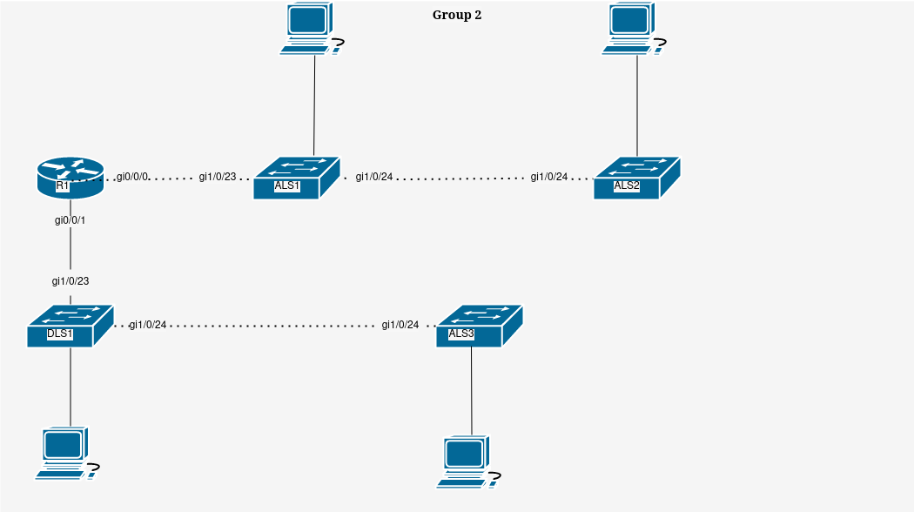
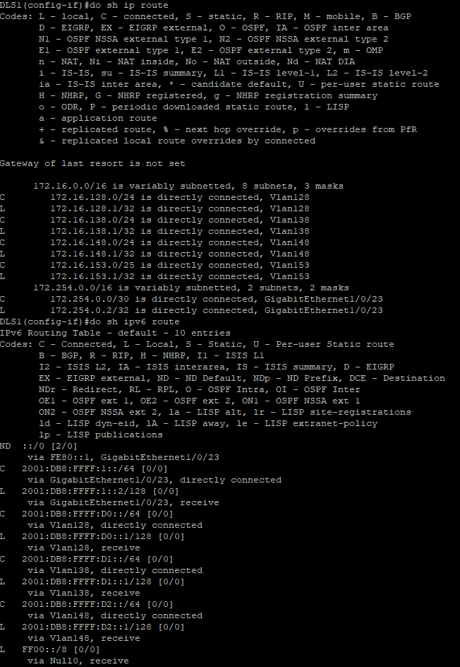
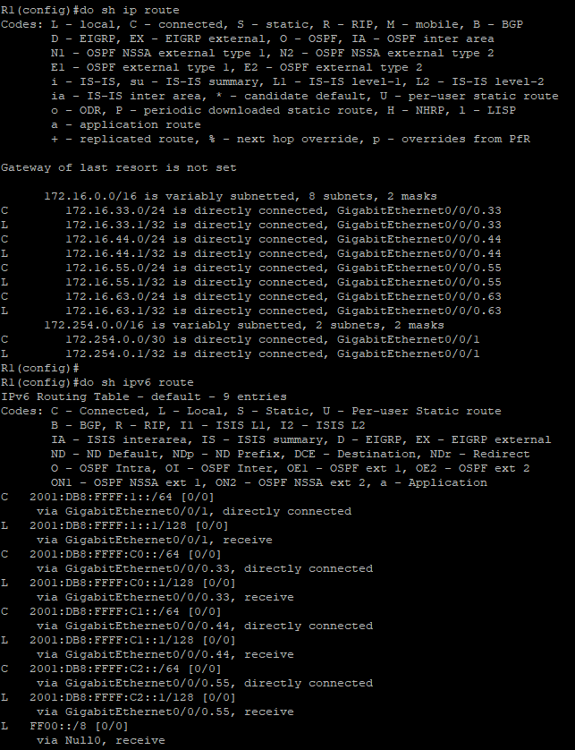

# Inter-Vlan Routing
by Trevor Zellmer

 Purpose
Vlans are useful for segmenting a network. But what happens if we need computers in different vlans to communicate with one-another? Inter-vlan routing allows this to happen. There are two separate types of inter-vlan routing discussed in this document. The "router on a stick" approach is older and can be used with cheaper equipment, this approach is used in the "r1 network" depicted below. The more efficent, modern inter-vlan routing method uses layer three swiches. This technique is used in the "DLS1 network" depicted below.


### New Commands


New Command | what it does
------------|-------------
sdm prefer dual-ipv4-and-ipv6 default | allow ipv6 on layer 3 switch (depricated)
int gi0/0/0.10 | create a subinterface
ip routing | enables routing on a layer 3 switch
no switchport | disables layer two on a layer 3 switch
encapuslation dot1q 33 | enables layer three conversion for vlans
sh ip route | display the ipv4 routes 
ipv6 unicast-routing | enable ipv6 on a layer 3 switch
sh ipv6 route |  display the ipv6 routes 


### Procedure

1. Attach cables based on the diagram below

2. Configure switch DLS1, ALS1, ALS2, and ALS3 using the [vlans procedural](cisco-vlans.md) and the table below.

<table>


<tr><th>R1 Network</th><th>DLS1 Network</th></tr>
<tr><td>

vlan | name | ALS1 | ALS2
-----|------|------|----------
33 | Sales | 1 - 8 | 1 - 6
44 | Manufacturing | 9 - 12 | 7 - 14
55 | Admin | 13 - 18 | 15 - 22
63 | ITmgmt | int vlan 63 | int vlan 63
888 | NativeOnly | NA | NA


</td><td>

vlan | name | ALS1 | ALS2 
-----|------|------|------
128 | Sales | 1 - 8 | 1 - 8
138 | Manufacturing | 9 - 12 | 9 - 12
148| Admin | 13 - 18 | 13 - 18
153 | ITmgmt | int vlan 153 | int vlan 153
999 | NativeOnly | NA | NA

</td></tr>

</table>

3. Configure the router and it's interfaces

interface | description | ipv4 | ipv6
----------|-------------|------|-----
gi0/0/1 | Connector | 172.254.0.1/30 | `2001:db8:ffff:1::1/64`
gi0/0/0.33| Sales | 172.16.33.1/24 | `2001:db8ffff:c0::1/64`
gi0/0/0.44| Manufacturing| 172.16.44.1/24 | `2001:db8ffff:c1::1/64`
gi0/0/0.55| Admin | 172.16.55.1/24 | `2001:db8ffff:c2::1/64`
gi0/0/0.33| ITmgmt | 172.16.63.1/24 | NA

- a. Configure router one based on the [base procedural](cisco-base-config.md) document and the table above.
- b. Select the Connector interface: **int gi0/0/1** 
- c. Assign it the ip addresses in the table above
- d. Select the sub interface: **int gi0/0/0.33**
- e. Enable encapsulation to mimic vlans: **encapsulation dot1q 33**
- f. Assign an address to the interface: **ip address 172.16.33.1 255.255.255.0**
- g. Assign an ipv6 address to the interface: **ipv6 add 2001:db8:ffff:c0::1/64**
- h. Repeat these steps for each sub-interface in the table above.


5. Enable layer 3 on switch DLS1
- a. Allow layer three: **ip routing**
- b. Allow ipv6 routing: **ipv6 unicast-routing**
- c. Save the config: **do copy run start**
- d. Reboot the switch: **reload**
- e. Enter interface configuration mode: **int g1/0/23**
- f. Disable layer two mode on the interface: **no switchport**
- g. Assign it an ipv4 address: **ip add 172.254.0.2 255.255.255.252**
- h. Assign it an ipv6 address: **ipv6 add 2001:db8:ffff:1::2/64** 

6. Create layer 3 compatiable vlans on DLS1

vlan | name | ipv6 address | ipv6 address
-----|------|--------------|------
128 | Sales | 172.16.128.1/24 | `2001:db8:ffff:d0::1/64`
138 | Manufacturing | 172.16.138.1/24 | `2001:db8:ffff:d1::1/64`
148| Admin | 172.16.148.1/24 | `2001:db8:ffff:d2::1/64`
153 | ITmgmt | int vlan 153 | int vlan 
999 | NativeOnly | NA | NA


- a. Create a vlan: **int vlan 128**
- b. Assign it an IP address: **ip add 172.16.128.1 255.255.255.0**
- c. Assign it an ipv6 address: **ipv6 add 2001:db8:ffff:d0::1/64**
- d. Repeat these steps to match the table.


### Verification and Troubleshooting
 1. Verify DLS1 configuration
 - a. Verify ipv4 configuration: **do sh ip route**
- b. Verify ipv6 configuration: **do sh ipv6 route**
- c. Ensure that your configuration matches the one below.
 

 2. Veriy R1 configuration
 - a. Verify ipv4 configuration: **do sh ip route**
- b. Verify ipv6 configuration: **do sh ipv6 route**
- c. Ensure that your configuration matches the one below.
 

3. If you cannot figure out what is wrong with a device, wipe it and retype all of the commands.
- a. Enter user exec mode: **en** </br>
- b. Enter global exec mode: **conf t** </br>
- c. Wipe the device to factory settings:  **write erase** </br>
- d. Reboot the device so that the changes take effect: **reload** </br>
- e. Refer to the instructions above for configuring each device on the network.

<details> <summary>Script</summary>


```
! ===============================
! This is switch 1 config
en
config t
hostname ALS1
no ip domain-lookup
line con 0
password cisco
login
logging sync
exec-time 120 0
enable secret class
service password-encryption
ip domain name challenge.local
crypto key generate rsa
1024
ip ssh ver 2
username student secret cisco 
username admin priv 15 secret cisco line vty 0 15 transport input ssh
login local
banner motd % keep out %
ip default-gateway 172.16.63.1
vlan 33
name Sales
exit
vlan 44
name Manufacturing
exit
vlan 55
name Admin
exit
vlan 63
name ITmgmt
exit
vlan 888
name NativeONLY
exit
int range gi1/0/1-8
switchport mode access
switchport access vlan 33
no shut
exit
int range gi1/0/9-12
switchport mode access
switchport access vlan 44
no shut
exit
int range gi1/0/13-18
switchport mode access
switchport access vlan 55
no shut
exit
int vlan 63
ip add 172.16.63.5 255.255.255.128
desc ITmgmt
no shut
exit
int gi1/0/23
!switchport trunk encapsulation dot1q
switchport nonegotiate
switchport mode trunk
switchport trunk allowed vlan 33,44,55,63
switchport trunk native vlan 888
no shut
exit
int gi1/0/24
!switchport trunk encapsulation dot1q
switchport nonegotiate
switchport mode trunk
switchport trunk allowed vlan 33,44,55,63
switchport trunk native vlan 888
no shut
exit
!copy run start
!show arp
!show run


! ===============================
! This is switch 2 config
en
config t
hostname ALS2
no ip domain-lookup
line con 0
password cisco
login
logging sync
exec-time 120 0
enable secret class
service password-encryption
ip domain name challenge.local
crypto key generate rsa
1024
ip ssh ver 2
username student secret cisco 
username admin priv 15 secret cisco
line vty 0 15
transport input ssh
login local
banner motd % keep out %
ip default-gateway 172.16.63.1
vlan 33
name Sales
exit
vlan 44
name Manufacturing
exit
vlan 55
name Admin
exit
vlan 63
name ITmgmt
exit
vlan 888
name NativeONLY
exit
int range gi1/0/1-6
switchport mode access
switchport access vlan 33
no shut
exit
int range gi1/0/7-14
switchport mode access
switchport access vlan 44
no shut
exit
int range gi1/0/15-22
switchport mode access
switchport access vlan 55
no shut
exit
int vlan 63
ip add 172.16.63.6 255.255.255.128
desc ITmgmt
no shut
exit
int gi1/0/23
switchport mode access
switchport access vlan 63
no shut
int gi1/0/24
!switchport trunk encapsulation dot1q
switchport nonegotiate
switchport mode trunk
switchport trunk allowed vlan 33,44,55,63
switchport trunk native vlan 888
no shut
exit
!sh ip trunk brief
!sh vlan brief
!copy run start
!show arp
!show run


! ===============================
! This is ALS3 config
en
config t
hostname ALS3
no ip domain-lookup
line con 0
password cisco
login
logging sync
exec-time 120 0
enable secret class
service password-encryption
ip domain name challenge.local
crypto key generate rsa
1024
ip ssh ver 2
username student secret cisco 
username admin priv 15 secret cisco
line vty 0 15
transport input ssh
login local
banner motd % keep out %
ip default-gateway 172.16.153.1
vlan 128
name Sales
exit
vlan 138
name Manufacturing
exit
vlan 148
name Admin
exit
vlan 153
name ITmgmt
exit
vlan 999
name NativeONLY
exit
int range gi1/0/1-8
switchport mode access
switchport access vlan 128
no shut
exit
int range gi1/0/9-12
switchport mode access
switchport access vlan 138
no shut
exit
int range gi1/0/13-18
switchport mode access
switchport access vlan 148
no shut
exit
int vlan 153
ip add 172.16.153.6 255.255.255.128
desc ITmgmt
no shut
exit
int gi1/0/24
!sdm prefer dual-ipv4-and-ipv6 default
!switchport trunk encapsulation dot1q
switchport nonegotiate
switchport mode trunk
switchport trunk allowed vlan 128,138,148,153
switchport trunk native vlan 999
no shut
exit
!sh ip trunk brief
!sh vlan brief
!copy run start
!show arp
!show run

! ===============================
! This is DLS1 config
en
config t
hostname DLS1
no ip domain-lookup
line con 0
password cisco
login
logging sync
exec-time 120 0
enable secret class
service password-encryption
ip domain name challenge.local
crypto key generate rsa
1024
ip ssh ver 2
username student secret cisco 
username admin priv 15 secret cisco
line vty 0 15
transport input ssh
login local
banner motd % keep out %
ip default-gateway 172.254.0.1
ip routing
ipv6 unicast-routing
!sdm prefer dual-ipv4-and-ipv6 default
do copy run start
reload
! ------ DSL1 part two of commands-------
vlan 138
name Sales
exit
vlan 138
name Manufacturing
vlan 148
name Admin
vlan 153
name ITmgmt
vlan 999
name NativeONLY
exit
int vlan 128
ip add 172.16.128.1 255.255.255.0
ipv6 add 2001:db8:ffff:d0::1/64
ipv6 add FE80::2 link-local
exit
int vlan 138
ip add 172.16.138.1 255.255.255.0
ipv6 add 2001:db8:ffff:d1::1/64
ipv6 add FE80::2 link-local
exit
int vlan 148
ip add 172.16.148.1 255.255.255.0
ipv6 add 2001:db8:ffff:d2::1/64
ipv6 add FE80::2 link-local
exit
int vlan 153
ip add 172.16.153.1 255.255.255.0
exit
int range gi1/0/1-8
switchport mode access
switchport access vlan 128
no shut
exit
int range gi1/0/9-12
switchport mode access
switchport access vlan 138
no shut
exit
int range gi1/0/13-18
switchport mode access
switchport access vlan 148
no shut
exit
int gi1/0/23
no switchport
ip add 172.254.0.2 255.255.255.252
ipv6 add 2001:db8:ffff:1::2/64
ipv6 add FE80::2 link-local
no shut
int vlan 153
ip add 172.16.153.1 255.255.255.128
desc ITmgmt
no shut
exit
int gi1/0/24
!switchport trunk encapsulation dot1q
switchport nonegotiate
switchport mode trunk
switchport trunk allowed vlan 128,138,148,153
switchport trunk native vlan 999
no shut
exit
!sh ip trunk brief
!sh vlan brief
!copy run start
!show arp
!show run


! ================================
! This is a generic router config
en
config t
hostname R1
no ip domain-lookup
line con 0
password cisco
login
logging sync
enable secret class
service password-encryption
ip domain name challenge.local
crypto key generate rsa
1024
ip ssh ver 2
username student secret cisco
username admin priv 15 secret cisco
line vty 0 15
transport input ssh
login local
banner motd % keep out %
! commands below this point are unqiue to routers
line aux 0
password cisco
login
ipv6 unicast-routing
!-- Make Subinterfaces
int gi0/0/0.33
encapsulation dot1q 33
ip address 172.16.33.1 255.255.255.0
ipv6 add 2001:db8:ffff:c0::1/64
ipv6 add FE80::3 link-local
int gi0/0/0.44
encapsulation dot1q 44
ip add 172.16.44.1 255.255.255.0
ipv6 add 2001:db8:ffff:c1::1/64
ipv6 add FE80::3 link-local
int gi0/0/0.55
encapsulation dot1q 55
ip address 172.16.55.1 255.255.255.0
ipv6 add 2001:db8:ffff:c2::1/64
ipv6 add FE80::3 link-local
int gi0/0/0.63
encapsulation dot1q 63
ip address 172.16.63.1 255.255.255.0
int gi0/0/0
desc Connect to ALS1
no shut
int gi0/0/1
desc Connect to DLS1
ip add 172.254.0.1 255.255.255.252
ipv6 add 2001:db8:ffff:1::1/64
ipv6 add FE80::3 link-local
no shut
```

</summary> </details>
