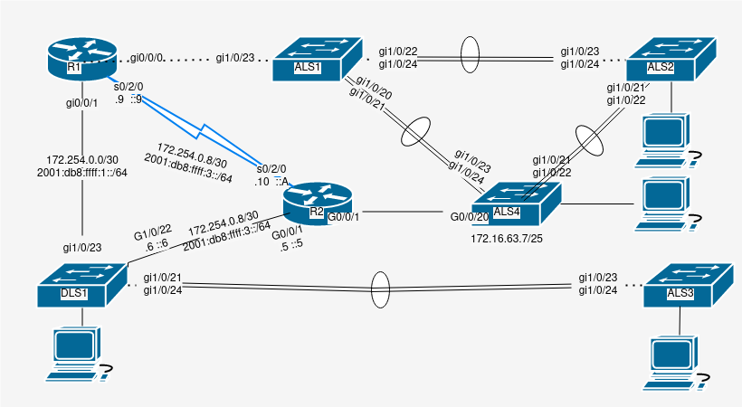

# Cisco Security
by Trevor Zellmer

Links:
> [cisco](cisco.md) </br>

## Purpose:
Securing ports and preventing DHCP flooding attacks is important. 
Without securty measures in place attackers can shut down networks
or get access to private information.


<details> <summary>New commands</summary>


New Command | What it does
------------|------------
clear port security | removes assigned mac address from secure port
sh port-security int g0/0/1 | display port security information
sh port-security address | show all of the mac addresses and how they were set
sh ip dhcp snooping | display snooping information
ip dhcp snooping | globally enable dhcp snooping
ip dhcp snooping vlan 5, 10, 50-60 | enable dhcp snooping on a range of vlans
ip dhcp snooping limit rate `<packets per second>` | use this for end user ports. It mitigates DHCP attacks
sh ip arp insp | show arp inspection global command
sh ip arp insp int | show all trusted interfaces
ip arp inspection vlan 33,44,55 | enable arp inspection on vlans
(config-if) ip arp inspection trust | don't do arp inspection because interface is trusted
(config-if) ip arp inspection valdiate src-mac | arp inspection mode 
(config-if) ip arp inspection valdiate dst-mac | arp inspection mode
(config-if) ip arp inspection valdiate ip | arp inspecton mode
(config-if) ip arp inspection valdiate src-mac dest-mac ip | Apply multiple modes at the same time
(config-if) no ip dhcp snooping information option | stops sending port info to dhcp server (for compatability)
(config-if) switchport port-security  | enable switchport security. Must run this 
(config-if) switchport port-security maximum 3 | sets the number of mac addreses on the port. Default is 1
(config-if) switchport port-security mac-address `<addressGoesHere>` | sets the address
(config-if) switchport port-security mac-address sticky | get mac addresses and save them
(config-if) switchport port-security violation shutdown | if a violation occurs, it is logged, and the device is shut down
(config-if) switchport port-security violation restrict | if a violation occurs, the port drops the packets, device logs the issue
(config-if) switchport port-security violation protect | if a violation occurs, drop the packets. no logging
(config-if) switcport port-security aging type absolue | sets the mac addreses to age constantly.
(config-if) switcport port-security aging type inactivity | sets the mac addresses to only age when inactive.
(config-if) switcport port-security aging static  | do not age addresses.
(config-if) switcport port-security aging time 14 | remove mac address 14 minutes after the aging condition
(config-if) ip dhcp snooping trust | use this for uplinks and server ports. Don't trust user ports
spanning-tree portfast | disable spanning tree on a single interfacd
spanning-tree portfast default | older global spanning tree portafast command 
spanning-tree portfast edge | spanning tree portfast single interface for modern switches
spanning-tree portfast edge default | spanning tree portfast global for modern interfaces
spanning-tree portfast bpduguard default | global safeguard to prevent broadcast storm
spanning-tree bpduguard enable | single interface safeguard to prevent broadcast storm
spanning-tree portfast bpduguard default | enable bpduguard


</summary> </details>

</br>


<details><summary>Theory</summary>


Secure unused ports like this:
```
vlan 1000
name BlackHole
int range g1/0/20-24, g0/0/18-20
shutdown
switchport mode access
switchport access vlan 1000

```

Enable port security on switchport
- only allow one mac address on port
- will shut down port if mac addres number > 1
```
switchport mode access
switchport port-security
end
```

Prevent VLan hopping attacks
```
!non trunking ports 
switcport mode access
exit

!trunking ports
switchport mode trunk
switchport nonegotiate
switchport trunk native vlan 999
end

!Inactive ports (throw them into blackhole vlan)
switchport mode access
switchport access vlan 1000
exit
```


To prevent MAC flooding attack
```
int g0/0/0
switcport access vlan 10
switcport mode access 
switchport port-security maximum 5
switchport port-security 
switchport port-security violation restrict
```

To shut down port if there are more than 4 mac addresses
```
int g0/0/0
switcport access vlan 20
switcport mode access 
switchport port-security maximum 4
switchport port-security 
switchport port-security mac-adress sticky
```

Manually configure mac addresses
```
int g0/0/0
switcport access vlan 30
switcport mode access 
switchport port-security 
switchport port-security mac-address aaa.bbb.ccc
```

</summary> </details>


</br>


 Procedure 1. Cable according to diagram



1. Blackhole all unused vlans
```
vlan 1000
name BlackHole
int range g1/0/19-20, g1/0/25-28
shut
switchport mode access
switchport access vlan 1000
```


2. Dhcp snooping and arp inspection on all switches (with table)
- a. **ip dhcp snooping vlan 33**
- b. **ip dhcp snooping vlan 44**
- c. **ip dhcp snooping vlan 55**
- d. **ip arp inspection validate src-mac ip**
- e. **no ip dhcp snooping information option**


3. Trust vlan trunks
- a. **int range po1-2**
- b. **ip dhcp snooping trust**
- c. **ip arp inspection trust**


4. Port security stuff on ALS2


- a. Assign the interface a specific mac address, and shutdown if a violation occurs:
```
int g1/0/1
    switchport port-security
    switchport port-security mac-address 00-0C-29-53-26-A1
    switchport port-security violation shutdown
```
</br>

- b. Allow interfaces to learn mac addresses 

```
int range g1/0/2-6
    switchport port-security
    switchport port-security mac-address sticky
    switchport port-security violation shutdown
```


- c. Only allow two mac addresses on theses interfaces. 
Wipe the interface after 5 minutes if there is no activity:
```
int range g1/0/7-14
    switchport port-security
    switchport port-security max 2
    switchport port-security aging type inactivity
    switchport port-security aging time 5
    switchport port-security violation shutdown
```


- d. Only allow five mac addresses on theses interfaces. 
Wipe the interface after 10 minutes if there is no activity:

```
int range g1/0/15-18
    switchport port-security
    switchport port-security max 5
    switchport port-security aging type inactivity
    switchport port-security aging time 10
    switchport port-security violation restrict
```


5. Port security stuff on ALS3
- a. Same commands as step 4
- b. Use different port ranges

<details> <summary>Commands for ALS3</summary>


```
int g1/0/1
    switchport port-security
    switchport port-security mac-address 00-0C-29-0D-70-73
    switchport port-security violation shutdown
int range g1/0/2-8
    switchport port-security
    switchport port-security mac-address sticky
    switchport port-security violation shutdown
int range g1/0/9-12
    switchport port-security
    switchport port-security max 2
    switchport port-security aging type inactivity
    switchport port-security aging time 5
    switchport port-security violation shutdown
int range g1/0/13-18
    switchport port-security
    switchport port-security max 5
    switchport port-security aging type inactivity
    switchport port-security aging time 10
    switchport port-security violation restrict
```

</summary> </details>

</br>


Troubleshooting and Verification

1. Add port security demonstration 
- show it being triggered
- re-enable it
- sh port-security address
- sh port-security int g0/0/1

2. make sure arp inspection is actually enabled
- ip arp inspection vlan 33,44,55


- a. display sh ip arp insp
sh ip arp insp int
sh ip arp insp vlan 33


<details> <summary>Script</summary>


```
! ===============================
! This is switch 1 config
en
config t
hostname ALS1
no ip domain-lookup
line con 0
password cisco login
logging sync
exec-time 120 0
enable secret class
service password-encryption
ip domain name challenge.local
crypto key generate rsa
1024
ip ssh ver 2
username student secret cisco 
username admin priv 15 secret cisco 
line vty 0 15
transport input ssh
login local
banner motd % keep out %
ip default-gateway 172.16.63.1
vlan 33
name Sales
exit
vlan 44
name Manufacturing
exit
vlan 55
name Admin
exit
vlan 63
name ITmgmt
exit
vlan 888
name NativeONLY
exit
int range gi1/0/1-8
switchport mode access
switchport access vlan 33
no shut
exit
int range gi1/0/9-12
switchport mode access
switchport access vlan 44
no shut
exit
int range gi1/0/13-18
switchport mode access
switchport access vlan 55
no shut
exit
int vlan 63
ip add 172.16.63.5 255.255.255.128
desc ITmgmt
no shut
exit
int range gi1/0/20-21
shut
channel-group 2 mode desir
int po2
shut
desc connect to ALS4
!switchport trunk encapsulation dot1q
switchport nonegotiate
switchport mode trunk
switchport trunk allowed vlan 33,44,55,63
switchport trunk native vlan 888
no shut
exit
int gi1/0/23
!switchport trunk encapsulation dot1q
switchport nonegotiate
switchport mode trunk
switchport trunk allowed vlan 33,44,55,63
switchport trunk native vlan 888
no shut
exit
int range gi1/0/24, gi1/0/22
shut
channel-group 1 mode active
int po1
shut
!switchport trunk encapsulation dot1q
switchport nonegotiate
switchport mode trunk
switchport trunk allowed vlan 33,44,55,63
switchport trunk native vlan 888
no shut
exit
spanning-tree mode rapid-pvst
spanning-tree portfast default
spanning-tree portfast bpduguard default
spanning-tree vlan 33 root primary
spanning-tree vlan 44 root primary
spanning-tree vlan 55 root secondary
spanning-tree vlan 63 root secondary
ip access-list standard BlockSales
 remark Block R1 Sales network
 deny   172.16.33.0 0.0.0.255
 remark Block 3750-2 Sales network
 deny   172.16.128.0 0.0.0.255
 permit any
line vty 0 15
 access-class BlockSales in
!copy run start
!show arp
!show run
vlan 1000
name BlackHole
int range g1/0/19, g1/0/25-28
shut
switchport mode access
switchport access vlan 1000
int range po1-2
ip dhcp snooping trust
ip arp inspection trust
exit
int g1/0/23
ip dhcp snooping trust
ip arp inspection trust
exit
ip dhcp snooping
ip dhcp snooping vlan 33
ip dhcp snooping vlan 44
ip dhcp snooping vlan 55
ip arp inspection vlan 33,44,55
ip arp inspection validate src-mac ip
no ip dhcp snooping information option


! ===============================
! This is switch 2 config
en
config t
hostname ALS2
no ip domain-lookup
line con 0
password cisco
login
logging sync
exec-time 120 0
enable secret class
service password-encryption
ip domain name challenge.local
crypto key generate rsa
1024
ip ssh ver 2
username student secret cisco 
username admin priv 15 secret cisco
line vty 0 15
transport input ssh
login local
banner motd % keep out %
ip default-gateway 172.16.63.1
vlan 33
name Sales
exit
vlan 44
name Manufacturing
exit
vlan 55
name Admin
exit
vlan 63
name ITmgmt
exit
vlan 888
name NativeONLY
exit
int range gi1/0/1-6
switchport mode access
switchport access vlan 33
no shut
exit
int range gi1/0/7-14
switchport mode access
switchport access vlan 44
no shut
exit
int range gi1/0/15-18
switchport mode access
switchport access vlan 55
no shut
exit
int vlan 63
ip add 172.16.63.6 255.255.255.128
desc ITmgmt
no shut
exit
int range gi1/0/23-24
shut
channel-group 1 mode active
int po1
shut
!switchport trunk encapsulation dot1q
switchport nonegotiate
switchport mode trunk
switchport trunk allowed vlan 33,44,55,63
switchport trunk native vlan 888
no shut
exit
int range gi1/0/21-22
shut
channel-group 2 mode active
int po2
shut
desc Connect to ALS4
!switchport trunk encapsulation dot1q
switchport nonegotiate
switchport mode trunk
switchport trunk allowed vlan 33,44,55,63
switchport trunk native vlan 888
no shut
exit
spanning-tree mode rapid-pvst
spanning-tree portfast default
spanning-tree portfast bpduguard default
ip access-list standard BlockSales
 remark Block R1 Sales network
 deny   172.16.33.0 0.0.0.255
 remark Block 3750-2 Sales network
 deny   172.16.128.0 0.0.0.255
 permit any
line vty 0 15
 access-class BlockSales in
vlan 1000
name BlackHole
int range g1/0/19-20, g1/0/25-28
shut
switchport mode access
switchport access vlan 1000
int range po1-2
ip dhcp snooping trust
ip arp inspection trust
exit
ip dhcp snooping
ip dhcp snooping vlan 33
ip dhcp snooping vlan 44
ip dhcp snooping vlan 55
ip arp inspection vlan 33,44,55
ip arp inspection validate src-mac ip
no ip dhcp snooping information option
int g1/0/1
    switchport port-security
    switchport port-security mac-address 00-0C-29-53-26-A1
    switchport port-security violation shutdown
int range g1/0/2-6
    switchport port-security
    switchport port-security mac-address sticky
    switchport port-security violation shutdown
int range g1/0/7-14
    switchport port-security
    switchport port-security max 2
    switchport port-security aging type inactivity
    switchport port-security aging time 5
    switchport port-security violation shutdown
int range g1/0/15-18
    switchport port-security
    switchport port-security max 5
    switchport port-security aging type inactivity
    switchport port-security aging time 10
    switchport port-security violation restrict


!sh ip trunk brief
!sh vlan brief
!copy run start
!show arp
!show run

! ===============================
! This is switch 3 config
en
config t
hostname ALS3
no ip domain-lookup
line con 0
password cisco
login
logging sync
exec-time 120 0
enable secret class
service password-encryption
ip domain name challenge.local
crypto key generate rsa
1024
ip ssh ver 2
username student secret cisco 
username admin priv 15 secret cisco
line vty 0 15
transport input ssh
login local
banner motd % keep out %
ip default-gateway 172.16.153.1
vlan 128
name Sales
exit
vlan 138
name Manufacturing
exit
vlan 148
name Admin
exit
vlan 153
name ITmgmt
exit
vlan 999
name NativeONLY
exit
int range gi1/0/1-8
switchport mode access
switchport access vlan 128
no shut
exit
int range gi1/0/9-12
switchport mode access
switchport access vlan 138
no shut
exit
int range gi1/0/13-18
switchport mode access
switchport access vlan 148
no shut
exit
int vlan 153
ip add 172.16.153.6 255.255.255.128
desc ITmgmt
no shut
exit
int range gi1/0/23-24
shut
channel-group 1 mode desir
int po1
shut
desc Connect to DLS1
!sdm prefer dual-ipv4-and-ipv6 default
!switchport trunk encapsulation dot1q
switchport nonegotiate
switchport mode trunk
switchport trunk allowed vlan 128,138,148,153
switchport trunk native vlan 999
no shut
exit
spanning-tree mode rapid-pvst
spanning-tree portfast default
spanning-tree portfast bpduguard default
ip access-list standard BlockSales
 remark Block R1 Sales network
 deny   172.16.33.0 0.0.0.255
 remark Block 3750-2 Sales network
 deny   172.16.128.0 0.0.0.255
 permit any
line vty 0 15
 access-class BlockSales in
vlan 1000
name BlackHole
int range g1/0/19-22, g1/0/25-28
shut
switchport mode access
switchport access vlan 1000
ip arp inspection vlan 128,138,148
int po1
ip dhcp snooping trust
ip arp inspection trust
exit
ip dhcp snooping
ip dhcp snooping vlan 128
ip dhcp snooping vlan 138
ip dhcp snooping vlan 148 
ip arp inspection validate src-mac ip
no ip dhcp snooping information option
int g1/0/1
    switchport port-security
    switchport port-security mac-address 00-0C-29-0D-70-73
    switchport port-security violation shutdown
int range g1/0/2-8
    switchport port-security
    switchport port-security mac-address sticky
    switchport port-security violation shutdown
int range g1/0/9-12
    switchport port-security
    switchport port-security max 2
    switchport port-security aging type inactivity
    switchport port-security aging time 5
    switchport port-security violation shutdown
int range g1/0/13-18
    switchport port-security
    switchport port-security max 5
    switchport port-security aging type inactivity
    switchport port-security aging time 10
    switchport port-security violation restrict


!sh ip trunk brief
!sh vlan brief
!copy run start
!show arp
!show run


! ===============================
! This is switch 4 config
en
config t
hostname ALS4
no ip domain-lookup
line con 0
password cisco
login
logging sync
exec-time 120 0
enable secret class
service password-encryption
ip domain name challenge.local
crypto key generate rsa
1024
ip ssh ver 2
username student secret cisco 
username admin priv 15 secret cisco
line vty 0 15
transport input ssh
login local
banner motd % keep out %
ip default-gateway 172.16.63.1
vlan 33
name Sales
exit
vlan 44
name Manufacturing
exit
vlan 55
name Admin
exit
vlan 63
name ITmgmt
exit
vlan 888
name NativeONLY
exit
int range gi1/0/1-6
switchport mode access
switchport access vlan 33
no shut
exit
int range gi1/0/7-14
switchport mode access
switchport access vlan 44
no shut
exit
int range gi1/0/15-18
switchport mode access
switchport access vlan 55
no shut
exit
int vlan 63
ip add 172.16.63.7 255.255.255.128
desc ITmgmt
no shut
exit
int range gi1/0/23-24
shut
channel-group 1 mode desir
int po1
shut
desc Connect to ALS1
!switchport trunk encapsulation dot1q
switchport nonegotiate
switchport mode trunk
switchport trunk allowed vlan 33,44,55,63
switchport trunk native vlan 888
no shut
exit
int range gi1/0/21-22
shut
channel-group 2 mode active
int po2
shut
desc Connect to ALS2
!switchport trunk encapsulation dot1q
switchport nonegotiate
switchport mode trunk
switchport trunk allowed vlan 33,44,55,63
switchport trunk native vlan 888
no shut
exit
int g1/0/20
shut
desc Connect to R2
switchport nonegotiate
switchport mode trunk
switchport trunk allowed vlan 33,44,55,63
switchport trunk native vlan 888
no shut
exit
spanning-tree mode rapid-pvst
spanning-tree portfast default
spanning-tree portfast bpduguard default
spanning-tree vlan 63 root primary
spanning-tree vlan 55 root primary
spanning-tree vlan 33 root secondary
spanning-tree vlan 44 root secondary
ip access-list standard BlockSales
 remark Block R1 Sales network
 deny   172.16.33.0 0.0.0.255
 remark Block 3750-2 Sales network
 deny   172.16.128.0 0.0.0.255
 permit any
line vty 0 15
 access-class BlockSales in
vlan 1000
name BlackHole
int range g1/0/19, g1/0/25-28
shut
switchport mode access
switchport access vlan 1000
int range po1-2
ip dhcp snooping trust
ip arp inspection trust
exit
int g1/0/20
ip dhcp snooping trust
ip arp inspection trust
exit
ip dhcp snooping
ip dhcp snooping vlan 33
ip dhcp snooping vlan 44
ip dhcp snooping vlan 55
ip arp inspection vlan 33,44,55
ip arp inspection validate src-mac ip
no ip dhcp snooping information option
!sh ip trunk brief
!sh vlan brief
!copy run start
!show arp
!show run


! ===============================
! This is DLS1 config
en
config t
hostname DLS1
no ip domain-lookup
line con 0
password cisco
login
logging sync
exec-time 120 0
enable secret class
service password-encryption
ip domain name challenge.local
crypto key generate rsa
1024
ip ssh ver 2
username student secret cisco 
username admin priv 15 secret cisco
line vty 0 15
transport input ssh
login local
banner motd % keep out %
ip default-gateway 172.254.0.1
ip routing
!sdm prefer dual-ipv4-and-ipv6 default
ipv6 unicast-routing
do copy run start
vlan 138
name Sales
exit
vlan 138
name Manufacturing
vlan 148
name Admin
vlan 153
name ITmgmt
vlan 999
name NativeONLY
exit
int vlan 128
ip add 172.16.128.1 255.255.255.0
ipv6 add 2001:db8:ffff:d0::1/64
ipv6 add FE80::A link-local
ip helper-address 192.168.150.1
exit
int vlan 138
ip add 172.16.138.1 255.255.255.0
ipv6 add 2001:db8:ffff:d1::1/64
ipv6 add FE80::A link-local
ip helper-address 192.168.150.1
exit
int vlan 148
ip add 172.16.148.1 255.255.255.0
ipv6 add 2001:db8:ffff:d2::1/64
ipv6 add FE80::A link-local
ip helper-address 192.168.150.1
exit
int vlan 153
ip add 172.16.153.1 255.255.255.0
ip helper-address 192.168.150.1
exit
int range gi1/0/1-8
switchport mode access
switchport access vlan 128
no shut
exit
int range gi1/0/9-12
switchport mode access
switchport access vlan 138
no shut
exit
int range gi1/0/13-18
switchport mode access
switchport access vlan 148
no shut
exit
int gi1/0/22
no switchport
ip add 172.254.0.6 255.255.255.252
ipv6 add 2001:db8:ffff:2::6/64
ipv6 add FE80::A link-local
no shut
int gi1/0/23
no switchport
ip add 172.254.0.2 255.255.255.252
ipv6 add 2001:db8:ffff:1::2/64
ipv6 add FE80::A link-local
no shut
int vlan 153
ip add 172.16.153.1 255.255.255.128
desc ITmgmt
no shut
exit
int range gi1/0/21, gi1/0/24
shut
channel-group 1 mode desir
int po1
shut
desc Connect to ALS3
!switchport trunk encapsulation dot1q
switchport nonegotiate
switchport mode trunk
switchport trunk allowed vlan 128,138,148,153
switchport trunk native vlan 999
no shut
exit
!sh ip trunk brief
!sh vlan brief
!copy run start
!show arp
!show run
!Step 6a & b
ip route 172.16.33.0 255.255.255.0 172.254.0.1
ipv6 route 2001:db8:ffff:c0::/64 2001:db8:ffff:1::1
ip route 172.16.33.0 255.255.255.0 172.254.0.5 16
ipv6 route 2001:db8:ffff:c0::/64 2001:db8:ffff:2::5 16
ip route 172.16.44.0 255.255.255.0 172.254.0.1
ipv6 route 2001:db8:ffff:c1::/64 2001:db8:ffff:1::1
ip route 172.16.44.0 255.255.255.0 172.254.0.5 16
ipv6 route 2001:db8:ffff:c1::/64 2001:db8:ffff:2::5 16
ip route 172.16.55.0 255.255.255.0 172.254.0.5
ipv6 route 2001:db8:ffff:c2::/64 2001:db8:ffff:1::1
ip route 172.16.55.0 255.255.255.0 172.254.0.1 16
ipv6 route 2001:db8:ffff:c2::/64 2001:db8:ffff:2::5 16
ip route 172.16.63.0 255.255.255.0 172.254.0.5
ip route 172.16.63.0 255.255.255.0 172.254.0.1 16
!Step 6c & d
ip route 172.254.0.8 255.255.255.252 172.254.0.1
ipv6 route 2001:db8:ffff:3::/64 2001:db8:ffff:1::1
ip route 172.254.0.8 255.255.255.252 172.254.0.5 32
ipv6 route 2001:db8:ffff:3::/64 2001:db8:ffff:2::5 32
!Step 6e & f
ip route 192.168.150.1 255.255.255.255 172.254.0.1
ipv6 route 2001:db8:acad:0::1/128 2001:db8:ffff:1::1
ip route 192.168.150.1 255.255.255.255 172.254.0.5 64
ipv6 route 2001:db8:acad:0::1/128 2001:db8:ffff:2::5 64
spanning-tree mode rapid-pvst
spanning-tree portfast default
spanning-tree portfast bpduguard default
ip access-list standard BlockSales
spanning-tree vlan 128 root primary
spanning-tree vlan 138 root primary
spanning-tree vlan 148  root primary 
spanning-tree vlan 153 root primary
ip access-list standard BlockSales
 remark Block R1 Sales network
 deny   172.16.33.0 0.0.0.255
 remark Block 3750-2 Sales network
 deny   172.16.128.0 0.0.0.255
 permit any
line vty 0 15
 access-class BlockSales in
ipv6 access-list BlockV6Sales
 remark Block R1 Sales IPv6 network
 deny   ipv6 2001:db8:ffff:c0::/64 any
 remark Block 3750-2 IPv6 network
 deny   ipv6 2001:db8:ffff:d0::/64 any
 permit ipv6 any any
line vty 0 15
 ipv6 access-class BlockV6Sales in
int vlan 128
ipv6 nd prefix default no-autoconfig
ipv6 nd managed-config-flag
ipv6 dhcp relay destination 2001:db8:acad:0::1
int vlan 138
ipv6 nd prefix default no-autoconfig
ipv6 nd managed-config-flag
ipv6 dhcp relay destination 2001:db8:acad:0::1
int vlan 148
ipv6 nd prefix default no-autoconfig
ipv6 nd managed-config-flag
ipv6 dhcp relay destination 2001:db8:acad:0::1
exit
vlan 1000
name BlackHole
int range g1/0/19-20, g1/1/1-4
shut
switchport mode access
switchport access vlan 1000
int po1
ip dhcp snooping trust
ip arp inspection trust
exit
int g1/0/23
ip arp inspection trust
exit
ip dhcp snooping
ip dhcp snooping vlan 128
ip dhcp snooping vlan 138
ip dhcp snooping vlan 148 
ip arp inspection validate src-mac ip
no ip dhcp snooping information option


! ================================
! This is router 1 config
en
config t
hostname R1
no ip domain-lookup
line con 0
password cisco
login
logging sync
enable secret class
service password-encryption
ip domain name challenge.local
crypto key generate rsa
1024
ip ssh ver 2
username student secret cisco
username admin priv 15 secret cisco
line vty 0 15
transport input ssh
login local
banner motd % keep out %
! commands below this point are unqiue to routers
line aux 0
password cisco
login
ipv6 unicast-routing
!-- Make Subinterfaces
int gi0/0/0.33
encapsulation dot1q 33
ip address 172.16.33.2 255.255.255.0
standby version 2
standby 1 ip 172.16.33.1
standby 1 priority 150
standby preempt
ipv6 add 2001:db8:ffff:c0::1/64
ipv6 add FE80::1 link-local
int gi0/0/0.44
encapsulation dot1q 44
ip add 172.16.44.2 255.255.255.0
standby version 2
standby 1 ip 172.16.44.1
standby 1 priority 150
standby preempt
ipv6 add 2001:db8:ffff:c0::1/64
ipv6 add 2001:db8:ffff:c1::1/64
ipv6 add FE80::1 link-local
int gi0/0/0.55
encapsulation dot1q 55
ip address 172.16.55.2 255.255.255.0
standby version 2
standby 1 ip 172.16.55.1
standby preempt
ipv6 add 2001:db8:ffff:c0::1/64
ipv6 add 2001:db8:ffff:c2::1/64
ipv6 add FE80::1 link-local
int gi0/0/0.63
encapsulation dot1q 63
ip address 172.16.63.2 255.255.255.0
standby version 2
standby 1 ip 172.16.63.1
standby preempt
ipv6 add FE80::1 link-local
int gi0/0/0
desc Connect to ALS1
no shut
int gi0/0/1
desc Connect to DLS1
ip add 172.254.0.1 255.255.255.252
ipv6 add 2001:db8:ffff:1::1/64
ipv6 add FE80::1 link-local
no shut
int s0/2/0
desc Connect to R2
ip add 172.254.0.9 255.255.255.252
ipv6 add 2001:db8:ffff:3::9/64
ipv6 add FE80::1 link-local
no shut
int Lo0
desc Loopback 0
ip add 192.168.150.1 255.255.255.255
ipv6 add 2001:db8:acad:0::1/128
ipv6 add FE80::1 link-local
no shut
exit
!Step 5a & b
ip route 172.16.128.0 255.255.255.0 172.254.0.2
ipv6 route 2001:db8:ffff:d0::/64 2001:db8:ffff:1::2 
ip route 172.16.128.0 255.255.255.0 172.254.0.10 16
ipv6 route 2001:db8:ffff:d0::/64 2001:db8:ffff:3::A 16
ip route 172.16.138.0 255.255.255.0 172.254.0.2
ipv6 route 2001:db8:ffff:d1::/64 2001:db8:ffff:1::2
ip route 172.16.138.0 255.255.255.0 172.254.0.10 16
ipv6 route 2001:db8:ffff:d1::/64 2001:db8:ffff:3::A 16
ip route 172.16.148.0 255.255.255.0 172.254.0.2
ipv6 route 2001:db8:ffff:d2::/64 2001:db8:ffff:1::2
ip route 172.16.148.0 255.255.255.0 172.254.0.10 16
ipv6 route 2001:db8:ffff:d2::/64 2001:db8:ffff:3::A 16
ip route 172.16.153.0 255.255.255.128 172.254.0.2
ip route 172.16.153.0 255.255.255.128 172.254.0.10 16
!Step 5c & d
ip route 172.254.0.4 255.255.255.252 172.254.0.2
ipv6 route 2001:db8:ffff:2::/64 2001:db8:ffff:1::2
ip route 172.254.0.4 255.255.255.252 172.254.0.10 32
ipv6 route 2001:db8:ffff:2::/64 2001:db8:ffff:3::A 32
ip route 172.16.33.0 255.255.255.0 172.254.0.10 24
ip route 172.16.44.0 255.255.255.0 172.254.0.10 24
ip route 172.16.55.0 255.255.255.0 172.254.0.10 24
ip route 172.16.63.0 255.255.255.128 172.254.0.10 24
ipv6 route 2001:db8:ffff:c0::/64 2001:db8:ffff:3::A 24
ipv6 route 2001:db8:ffff:c1::/64 2001:db8:ffff:3::A 24
ipv6 route 2001:db8:ffff:c2::/64 2001:db8:ffff:3::A 24
spanning-tree mode rapid-pvst
spanning-tree portfast default
spanning-tree portfast bpduguard default
ip access-list standard BlockSales
 remark Block R1 Sales network
 deny   172.16.33.0 0.0.0.255
 remark Block 3750-2 Sales network
 deny   172.16.128.0 0.0.0.255
 permit any 
 line vty 0 15
 access-class BlockSales in
ipv6 access-list BlockV6Sales
 remark Block R1 Sales IPv6 network
 deny   ipv6 2001:db8:ffff:c0::/64 any
 remark Block 3750-2 IPv6 network
 deny   ipv6 2001:db8:ffff:d0::/64 any
 permit ipv6 any any
line vty 0 15
 ipv6 access-class BlockV6Sales in
ip dhcp excluded-address 172.16.33.0
ip dhcp pool Sales
default-router 172.16.33.1
DNS-server 8.8.8.8
domain-name challenge.local
lease 0 6
network 172.16.33.0 255.255.255.0
ip dhcp excluded-address 192.168.128.1 192.168.128.10
ip dhcp pool Sales2
default-router 172.16.128.1
DNS-server 8.8.8.8
domain-name challenge.local
lease 0 6
network 172.16.128.0 255.255.255.0
ipv6 dhcp pool Sales16
address prefix 2001:db8:ffff:c0::/64
dns-server 2001:4860:4860::8888
domain-name challenge.local
int gi0/0/0.33
ipv6 dhcp server Sales16
ipv6 nd prefix default no-autoconfig
exit
ipv6 dhcp pool Sales26
address prefix 2001:db8:ffff:d0::/64
dns-server 2001:4860:4860::8888
domain-name challenge.local
ip dhcp excluded-address 172.16.44.0 172.16.44.10
ip dhcp pool Manufacturing
default-router 172.16.44.1
DNS-server 8.8.8.8
domain-name challenge.local
network 172.16.44.0 255.255.255.0
ip dhcp excluded-address 172.16.138.0 172.16.138.10
ip dhcp pool Manufacturing2
default-router 172.16.138.1
DNS-server 8.8.8.8
domain-name challenge.local
network 172.16.138.0 255.255.255.0
ipv6 dhcp pool Manufacturing16
address prefix 2001:db8:ffff:c1::/64
dns-server 2001:4860:4860::8888
domain-name challenge.local
int gi0/0/0.44
ipv6 dhcp server Manufacturing16
ipv6 nd prefix default no-autoconfig
exit
ipv6 dhcp pool Manufacturing26
address prefix 2001:db8:ffff:d1::/64
dns-server 2001:4860:4860::8888
domain-name challenge.local
ip dhcp excluded-address 172.16.55.0 172.16.55.10
ip dhcp pool Admin
default-router 172.16.55.1
DNS-server 8.8.8.8
domain-name challenge.local
network 172.16.55.0 255.255.255.0
ip dhcp excluded-address 172.16.148.0 172.16.148.10
ip dhcp pool Admin2
default-router 172.16.148.1
DNS-server 8.8.8.8
domain-name challenge.local
network 172.16.148.0 255.255.255.0
ipv6 dhcp pool Admin16
address prefix 2001:db8:ffff:c2::/64
dns-server 2001:4860:4860::8888
domain-name challenge.local
int g0/0/0.55
ipv6 dhcp server Admin16
ipv6 nd prefix default no-autoconfig
exit
ipv6 dhcp pool Admin26
address prefix 2001:db8:ffff:d2::/64
dns-server 2001:4860:4860::8888
domain-name challenge.local
ip dhcp excluded-address 172.16.63.0
ip dhcp pool ITmgmt
default-router  172.16.63.1
DNS-server 8.8.8.8
domain-name challenge.local
network 172.16.63.0 255.255.255.128
ip dhcp excluded-address 172.16.153.1 172.16.153.10
ip dhcp pool ITmgmt2
default-router 172.16.153.1
DNS-server 8.8.8.8
domain-name challenge.local
network 172.16.153.0 255.255.255.128
int g0/0/1
ipv6 dhcp server automatic 
int s0/2/0
ipv6 dhcp server automatic 

! ================================
! This is router 2 config
en
config t
hostname R2
no ip domain-lookup
line con 0
password cisco
login
logging sync
enable secret class
service password-encryption
ip domain name challenge.local
crypto key generate rsa
1024
ip ssh ver 2
username student secret cisco
username admin priv 15 secret cisco
line vty 0 15
transport input ssh
login local
banner motd % keep out %
! commands below this point are unqiue to routers
line aux 0
password cisco
login
ipv6 unicast-routing
int s0/2/0
desc Connect to R1
ip add 172.254.0.10 255.255.255.252
ipv6 add 2001:db8:ffff:3::A/64
ipv6 add FE80::2 link-local
no shut
int gi0/0/1
desc Connect to DLS1
ip add 172.254.0.5 255.255.255.252
ipv6 add 2001:db8:ffff:2::5/64
ipv6 add FE80::2 link-local
no shut
exit
int gi0/0/0.33
encapsulation dot1q 33
ip address 172.16.33.3 255.255.255.0
standby version 2
standby 1 ip 172.16.33.1
standby 1 preempt
ipv6 add 2001:db8:ffff:c0::3/64
ipv6 add FE80::2 link-local
ip helper-address 192.168.150.1
ipv6 nd prefix default no-autoconfig
ipv6 nd managed-config-flag
ipv6 dhcp relay destination 2001:db8:acad:0::1
int gi0/0/0.44
encapsulation dot1q 44
ip add 172.16.44.3 255.255.255.0
standby version 2
standby 1 ip 172.16.44.1
standby 1 preempt
ipv6 add 2001:db8:ffff:c1::3/64
ipv6 add FE80::2 link-local
ip helper-address 192.168.150.1
ipv6 nd prefix default no-autoconfig
ipv6 nd managed-config-flag
ipv6 dhcp relay destination 2001:db8:acad:0::1
int gi0/0/0.55
encapsulation dot1q 55
ip address 172.16.55.3 255.255.255.0
standby version 2
standby 1 ip 172.16.55.1
standby 1 priority 150
standby 1 preempt
ipv6 add 2001:db8:ffff:c2::3/64
ipv6 add FE80::2 link-local
ip helper-address 192.168.150.1
ipv6 nd prefix default no-autoconfig
ipv6 nd managed-config-flag
ipv6 dhcp relay destination 2001:db8:acad:0::1
int gi0/0/0.63
encapsulation dot1q 63
ip address 172.16.63.3 255.255.255.0
standby version 2
standby 1 ip 172.16.63.1
standby 1 priority 150
standby 1 preempt
ipv6 add FE80::2 link-local
ip helper-address 192.168.150.1
ipv6 nd prefix default no-autoconfig
ipv6 nd managed-config-flag
ipv6 dhcp relay destination 2001:db8:acad:0::1
int gi0/0/0
desc Connect to ALS4
no shut
!Step 7a & b
ip route 172.16.33.0 255.255.255.0 172.254.0.9
ipv6 route 2001:db8:ffff:c0::/64 2001:db8:ffff:3::9
ip route 172.16.33.0 255.255.255.0 172.254.0.6 16
ipv6 route 2001:db8:ffff:c0::/64 2001:db8:ffff:2::6 16
ip route 172.16.44.0 255.255.255.0 172.254.0.9
ipv6 route 2001:db8:ffff:c1::/64 2001:db8:ffff:3::9
ip route 172.16.44.0 255.255.255.0 172.254.0.6 16
ipv6 route 2001:db8:ffff:c1::/64 2001:db8:ffff:2::6 16
ip route 172.16.55.0 255.255.255.0 172.254.0.9
ipv6 route 2001:db8:ffff:c2::/64 2001:db8:ffff:3::9
ip route 172.16.55.0 255.255.255.0 172.254.0.6 16
ipv6 route 2001:db8:ffff:c2::/64 2001:db8:ffff:2::6 16
ip route 172.16.63.0 255.255.255.0 172.254.0.9
ip route 172.16.63.0 255.255.255.0 172.254.0.6 16
!Step 7c & d
ip route 172.16.128.0 255.255.255.0 172.254.0.6
ipv6 route 2001:db8:ffff:d0::/64 2001:db8:ffff:2::6
ip route 172.16.128.0 255.255.255.0 172.254.0.9 16
ipv6 route 2001:db8:ffff:d0::/64 2001:db8:ffff:3::9 16
ip route 172.16.138.0 255.255.255.0 172.254.0.6
ipv6 route 2001:db8:ffff:d1::/64 2001:db8:ffff:2::6
ip route 172.16.138.0 255.255.255.0 172.254.0.9 16
ipv6 route 2001:db8:ffff:d1::/64 2001:db8:ffff:3::9 16
ip route 172.16.148.0 255.255.255.0 172.254.0.6
ipv6 route 2001:db8:ffff:d2::/64 2001:db8:ffff:2::6
ip route 172.16.148.0 255.255.255.0 172.254.0.9 16
ipv6 route 2001:db8:ffff:d2::/64 2001:db8:ffff:3::9 16
ip route 172.16.153.0 255.255.255.128 172.254.0.6
ip route 172.16.153.0 255.255.255.128 172.254.0.9 16
!Step 7e & f
ip route 172.254.0.0 255.255.255.252 172.254.0.6
ipv6 route 2001:db8:ffff:1::/64 2001:db8:ffff:2::6
ip route 172.254.0.0 255.255.255.252 172.254.0.9 32
ipv6 route 2001:db8:ffff:1::/64 2001:db8:ffff:3::9 32
!Step 7g & h
ip route 192.168.150.1 255.255.255.255 172.254.0.9
ipv6 route 2001:db8:acad:0::1/128 2001:db8:ffff:3::9
ip route 192.168.150.1 255.255.255.255 172.254.0.6 64
ipv6 route 2001:db8:acad:0::1/128 2001:db8:ffff:2::6 64
ip route 172.16.33.0 255.255.255.0 172.254.0.7 24
ip route 172.16.44.0 255.255.255.0 172.254.0.7 24
ip route 172.16.55.0 255.255.255.0 172.254.0.7 24
ip route 172.16.63.0 255.255.255.128 172.254.0.7 24
ipv6 route 2001:db8:ffff:c0::/64 2001:db8:ffff:1::7 24
ipv6 route 2001:db8:ffff:c1::/64 2001:db8:ffff:1::7 24
ipv6 route 2001:db8:ffff:c2::/64 2001:db8:ffff:1::7 24
spanning-tree mode rapid-pvst
spanning-tree portfast default
spanning-tree portfast bpduguard default
ip access-list standard BlockSales
 remark Block R1 Sales network
 deny   172.16.33.0 0.0.0.255
 remark Block 3750-2 Sales network
 deny   172.16.128.0 0.0.0.255
 permit any
line vty 0 15
 access-class BlockSales in
 ipv6 access-list BlockV6Sales
 remark Block R1 Sales IPv6 network
 deny   ipv6 2001:db8:ffff:c0::/64 any
 remark Block 3750-2 IPv6 network
 deny   ipv6 2001:db8:ffff:d0::/64 any
 permit ipv6 any any
line vty 0 15
 ipv6 access-class BlockV6Sales in
```

</summary> </details>
