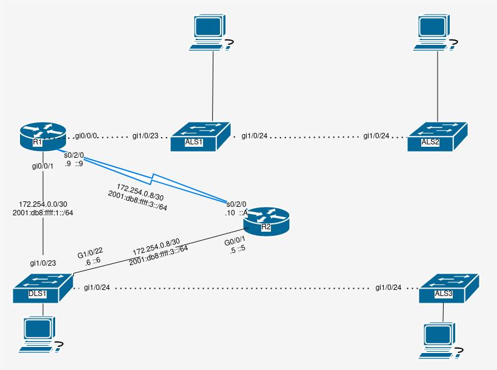
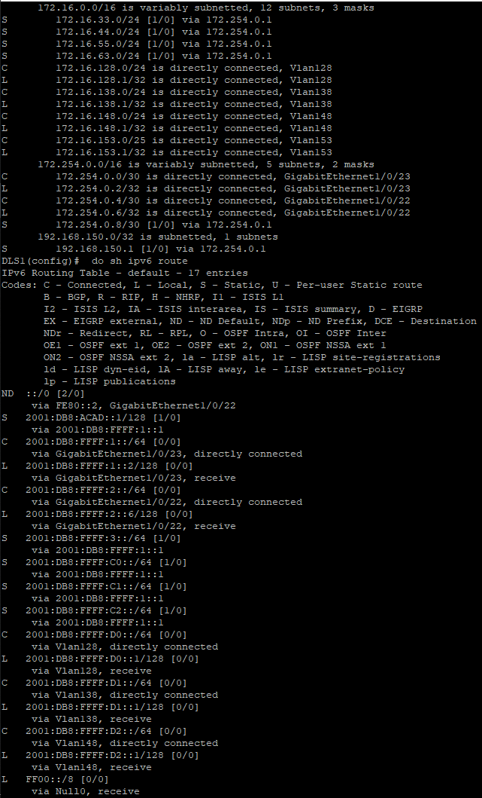
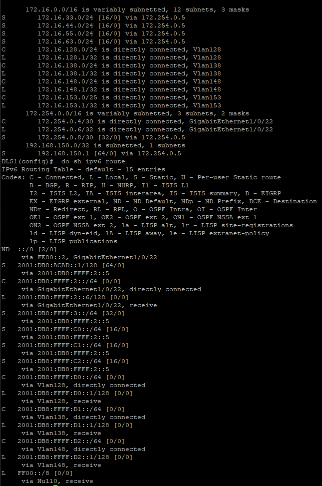
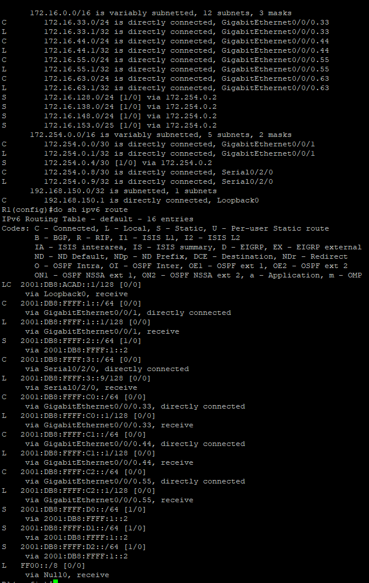
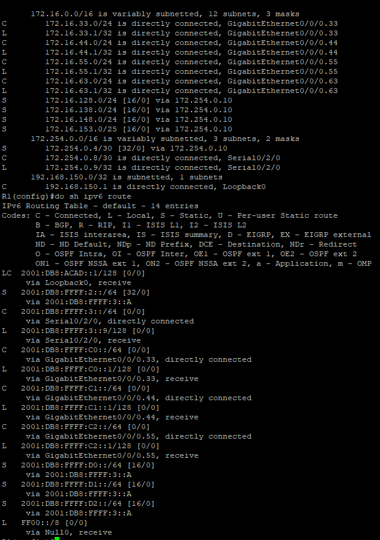
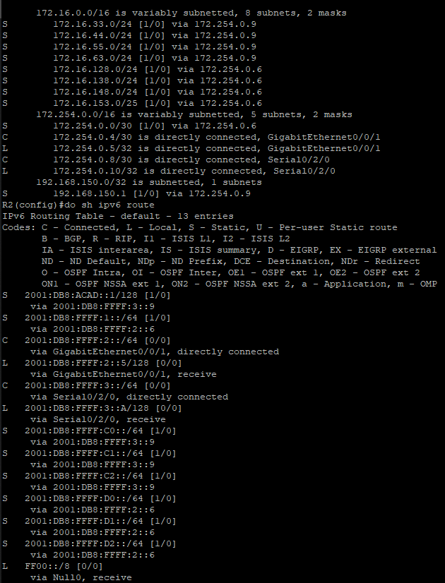

# Static Routing
by Trevor Zellmer

## Purpose
Technology often fails, so having routes, and backup routes is often important to ensuring connectivity especially for critical infrastructure. This document explains how to configure static and floating next-hop routes on routers and a layer three switch.

## New Commands


New Command | what it does
------------|-------------
sh ip route | display the ipv4 routes 
sh ipv6 route |  display the ipv6 routes 
no switchport | configure a switchport to use layer 3
ip route 192.168.1.0 255.255.255.0 10.10.10.2 | add route
ipv6 route 2001:db8:ffff:c0::/64 2001:db8:ffff:1::1 | add ipv6 route
ip route 192.168.1.0 255.255.255.0 10.10.10.2 23 | add floating route
ipv6 route 2001:db8:ffff:c0::/64 2001:db8:ffff:1::1 32 | add floating ipv6 route
ip route 0.0.0.0 0.0.0.0  10.10.10.1 | add default route
ip route ::/0 2001:db8:ffff:1::1 | add ipv6 default route
ip route 192.168.1.0 255.255.255.255 10.10.10.2 | add host route
ipv6 route 2001:db8:ffff:c0::/128 2001:db8:ffff:1::1 | add ipv6 host route


## Procedure

1. Attach cables based on the diagram below




2. Configure ALS1 - 3, DLS1, and R1 based on the [inter vlan routing document](cisco-intervlan-routing.md)

3. Add a loopback interface to R1
- a. Add a loopback interface **int Lo0**
- b. Add a description : **desc Loopback 0**
- c. Add an ipv4 address: **ip add 192.168.150.1 255.255.255.255**
- d. Add an ipv6 address: **ipv6 add 2001:db8:acad:0::1/128**
- e. Add a link local address: **ipv6 add FE80::1 link-local**
- f. Enable the interface: **no shut**

4. Add a serial interface to R1
- a. A serial interface:  **int s0/2/0**
- b. Add a description: **desc Connect to R2**
- c. Add a ipv4 address: **ip add 172.254.0.9 255.255.255.252**
- d. Add a ipv6 address: **ipv6 add 2001:db8:ffff:3::9/64**
- e. Add a link-ocal address: **ipv6 add FE80::1 link-local**
- f. Enable the interface **no shut**


5. Configure R1's route table
- a. Create a route: **`ip route <destination network> <subnet mask> <next router>`**
- b. Create a an ipv6 route : **`ipv6 route <destination network> <subnet mask> <next router>`**
- c. Create a backup route: **`ip route <destination network> <subnet mask> <next router> <Distance>`**
- d. Create an ipv6 backup route: **`ipv6 route <destination network> <subnet mask> <next router> <Distance>`**
- e. Create all of the routes in the table below using these commands


Desination | Destination network | next router | Distance
-----------|---------------------|-----------------|-----------------
VLAN 128 | 172.16.128.0/24 |  172.254.0.2 | NA
VLAN 128 | 2001:db8:ffff:d0::/64 | 2001:db8:ffff:1::2 | NA
VLAN 128 | 172.16.128.0/24 |  172.254.0.10 | 16
VLAN 128 | 2001:db8:ffff:d0::/64 | 2001:db8:ffff:3::A | 16
VLAN 138 | 172.16.138.0/24 |  172.254.0.2 | NA
VLAN 138 | 2001:db8:ffff:d1::/64 | 2001:db8:ffff:1::2 | NA
VLAN 138 | 172.16.138.0/24 | 172.254.0.10 | 16
VLAN 138 | 2001:db8:ffff:d1::/64 | 2001:db8:ffff:3::A | 16
VLAN 148 | 172.16.148.0/24 | 172.254.0.2 | NA
VLAN 148 | 2001:db8:ffff:d2::/64 | 2001:db8:ffff:1::2 | NA
VLAN 148 | 172.16.148.0/24 | 172.254.0.10 | 16
VLAN 148 | 2001:db8:ffff:d2::/64 | 2001:db8:ffff:3::A | 16
VLAN 153 | 172.16.153.0/25 | 172.254.0.2 | NA
VLAN 153 | 172.16.153.0/25 | 172.254.0.10 16 | NA
R2/DLS1 link | 172.254.0.4/30 | 172.254.0.2 | NA
R2/DLS1 link |  2001:db8:ffff:2::/64 | 2001:db8:ffff:1::2 | NA
R2/DLS1 link | 172.254.0.4/30 | 172.254.0.10 | 32
R2/DLS1 link | 2001:db8:ffff:2::/64 | 2001:db8:ffff:3::A | 32


6. Configure the serial interface on R2
- a. Configure the serial interface: **int s0/2/0**
- b. Rename the interface: **desc Connect to R1**
- c. Supply an ipv4 address: **ip add 172.254.0.10 255.255.255.252**
- d. Supply an ipv6 address: **ipv6 add 2001:db8:ffff:3::A/64**
- e. Configure the link local address: **ipv6 add FE80::2 link-local**
- f. Enable the interface: **no shut**

7. Configure an interface on R2 to connect to DLS1
- a. Configure the interface: **int gi0/0/1**
- b. Create a description: **desc Connect to DLS1**
- c. Give it an ip address: **ip add 172.254.0.5 255.255.255.252**
- d. Give it an ipv6 address: **ipv6 add 2001:db8:ffff:2::5/64**
- e. Give it a link-local address: **ipv6 add FE80::2 link-local**
- f. Don't forget to enable it!

8. Configure the route table on R2
- a. Create a route: **`ip route <destination network> <subnet mask> <next router>`**
- b. Create a an ipv6 route : **`ipv6 route <destination network> <subnet mask> <next router>`**
- c. Create a backup route: **`ip route <destination network> <subnet mask> <next router> <Distance>`**
- d. Create an ipv6 backup route: **`ipv6 route <destination network> <subnet mask> <next router> <Distance>`**
- e. Create all of the routes in the table below using these commands


Desination | Destination network | next router | Distance
-----------|---------------------|-----------------|-----------------
VLAN 33 | 172.16.33.0/24 |  172.254.0.1 | NA
VLAN 33 | 2001:db8:ffff:c0::/64  | 2001:db8:ffff:1::1 | NA
VLAN 33 | 172.16.33.0/24 |  172.254.0.6 | 16
VLAN 33 | 2001:db8:ffff:c0::/64 | 2001:db8:ffff:2::6 | 16
VLAN 44 | 172.16.44.0/24 |  172.254.0.1 | NA
VLAN 44 | 2001:db8:ffff:c1::/64 | 2001:db8:ffff:1::1 | NA
VLAN 44 | 172.16.44.0/24 | 172.254.0.6 | 16
VLAN 44 | 2001:db8:ffff:c1::/64 | 2001:db8:ffff:2::6 | 16
VLAN 55 | 172.16.55.0/24 | 172.254.0.1 | NA
VLAN 55 | 2001:db8:ffff:c2::/64 | 2001:db8:ffff:1::1 | NA
VLAN 55 | 172.16.55.0 | 172.254.0.6 | 16
VLAN 55 | 2001:db8:ffff:c2::/64 | 2001:db8:ffff:2::6 | 16
VLAN 63 | 172.16.63.0/24 |  172.254.0.1 | NA
VLAN 63 | 172.16.63.0/24 | 172.254.0.6 | 16
VLAN 128 | 172.16.128.0/24 | 172.254.0.6 | NA
VLAN 128 | 2001:db8:ffff:d0::/64 | 2001:db8:ffff:2::6 | NA
VLAN 128 | 172.16.128.0/24 | 172.254.0.9 | 16
VLAN 128 | 2001:db8:ffff:d0::/64 | 2001:db8:ffff:3::9 | 16
VLAN 138 | 172.16.138.0/24 | 172.254.0.6 | NA
VLAN 138 | 2001:db8:ffff:d1::/64 | 2001:db8:ffff:2::6 | NA
VLAN 138 | 172.16.138.0/24 |  172.254.0.9 | 16
VLAN 138 | 2001:db8:ffff:d1::/64 | 2001:db8:ffff:3::9 | 16
VLAN 148 | 172.16.148.0/24 | 172.254.0.6 | NA
VLAN 148 | 2001:db8:ffff:d2::/64 | 2001:db8:ffff:2::6 | NA
VLAN 148 | 172.16.148.0/24 | 172.254.0.9 | 16 
VLAN 148 | 2001:db8:ffff:d2::/64 | 2001:db8:ffff:3::9 | 16
VLAN 153 | 172.16.153.0/25 | 172.254.0.6 | NA
VLAN 153 | 172.16.153.0/25 | 172.254.0.9 | 16
Serial | 172.254.0.0/30 | 172.254.0.6 | NA
Serial | 2001:db8:ffff:1::/64 | 2001:db8:ffff:2::6 | NA
Serial | 172.254.0.0/30 | 172.254.0.9 | 32
Serial | 2001:db8:ffff:1::/64 | 2001:db8:ffff:3::9 | 32
R1 Loopback | 192.168.150.1/30 | 172.254.0.9 | NA
R1 Loopback | 2001:db8:acad:0::1/128 | 2001:db8:ffff:3::9 | NA
R1 Loopback | 192.168.150.1/30 |  172.254.0.6 | 64 
R1 Loopback | 2001:db8:acad:0::1/128 | 2001:db8:ffff:2::6 | 64


9. Configure an interface on DLS1 to communicate with R2
- a. Configure interface: **int gi1/0/22**
- b. Set to layer 3: **no switchport**
- c. Add ipv4 address: **ip add 172.254.0.6 255.255.255.252**
- d. Add ipv6 address: **`ipv6 add 2001:db8:ffff:2::6/64`**
- e. Add link-local address: **ipv6 add FE80::A link-local**

10. Configure routes on DLS1
- a. Create a route: **`ip route <destination network> <subnet mask> <next router>`**
- b. Create a an ipv6 route : **`ipv6 route <destination network> <subnet mask> <next router>`**
- c. Create a backup route: **`ip route <destination network> <subnet mask> <next router> <Distance>`**
- d. Create an ipv6 backup route: **`ipv6 route <destination network> <subnet mask> <next router> <Distance>`**
- e. Create all of the routes in the table below using these commands


Desination | Destination network | next router | Distance
-----------|---------------------|-----------------|-----------------
VLAN 33 | 172.16.33.0/24 | 172.16.254.0.1 | NA
VLAN 33 | 2001:db8:ffff:c0::/64 | 2001:db8:ffff:1::1 | NA
VLAN 33 | 172.16.33.0/24 | 172.16.254.0.5 | 16
VLAN 33 | 2001:db8:ffff:c0::/64 | 2001:db8:ffff:2::5 | 16
VLAN 44 | 172.16.44.0/24 | 172.16.254.0.1 | NA
 VLAN 44 | 2001:db8:ffff:c1::/64 | 2001:db8:ffff:1::1 | NA
VLAN 44 | 172.16.44.0/24 | 172.16.254.0.5 | 16
VLAN 44 | 2001:db8:ffff:c1::/64 | 2001:db8:ffff:2::5 | 16
 VLAN 55 | 172.16.55.0/24 | 172.16.254.0.1 | NA
 VLAN 55 | 2001:db8:ffff:c2::/64 | 2001:db8:ffff:1::1 | NA
 VLAN 55 | 172.16.55.0/24 | 172.16.254.0.5 | 16
 VLAN 55 | 2001:db8:ffff:c2::/64 | 2001:db8:ffff:2::5 | 16
VLAN 63 | 172.16.63.0/24 | 172.16.254.0.1 | NA
Serial | 172.254.0.8/30 | 172.254.0.1 | NA
Serial | 2001:db8:ffff::3/64 | 2001:db8:ffff:1::1 | NA
Serial | 172.254.0.8/30 | 172.254.0.5 | 32
Serial | 2001:db8:ffff::3/64 | 2001:db8:ffff:2::5 | 32
R1 Loopback | 192.168.150.1/32 | 172.254.0.1 | NA
R1 Loopback | 2001:db8:acad:0::1/128 | 2001:db8:ffff:1::1 | NA
R1 Loopback | 192.168.150.1/32 | 172.254.0.5 | 64
R1 Loopback | 2001:db8:acad:0::1/128 | 2001:db8:ffff:2::5 | 64 


## Troubleshooting and verificaiton

1. Verify routes on DLS1
- a. display current routes: **sh ip route**
- b. display current ipv6 routes **sh ipv6 route**
- c. ensure that your configuartion matches that below


2. Verify backup routes on DLS1
- a. Unplug S0/2/0 
- b. display current routes: **sh ip route**
- c. display current ipv6 routes **sh ipv6 route**
- d. ensure your configuration matches that below


3. Verify routes on R1
- a. display current routes: **sh ip route**
- b. display current ipv6 routes **sh ipv6 route**
- c. ensure that your configuartion matches that below

4. Verify backup routes on R1
- a. Unplug S0/2/0 
- b. display current routes: **sh ip route**
- c. display current ipv6 routes **sh ipv6 route**
- d. ensure your configuration matches that below

5. Verify routes on R2
- a. display current routes: **sh ip route**
- b. display current ipv6 routes **sh ipv6 route**
- c. ensure your configuration matches that below


6. If you cannot figure out what is wrong with a device, wipe it and retype all of the commands.
- a. Enter user exec mode: **en** </br>
- b. Enter global exec mode: **conf t** </br>
- c. Wipe the device to factory settings:  **write erase** </br>
- d. Reboot the device so that the changes take effect: **reload** </br>
- e. Refer to the instructions above for configuring each device on the network.


<details> <summary>Script</summary>


```
! ===============================
! This is switch 1 config
en
config t
hostname ALS1
no ip domain-lookup
line con 0
password cisco
login
logging sync
exec-time 120 0
enable secret class
service password-encryption
ip domain name challenge.local
crypto key generate rsa
1024
ip ssh ver 2
username student secret cisco 
username admin priv 15 secret cisco 
line vty 0 15
transport input ssh
login local
banner motd % keep out %
ip default-gateway 172.16.63.1
vlan 33
name Sales
exit
vlan 44
name Manufacturing
exit
vlan 55
name Admin
exit
vlan 63
name ITmgmt
exit
vlan 888
name NativeONLY
exit
int range gi1/0/1-8
switchport mode access
switchport access vlan 33
no shut
exit
int range gi1/0/9-12
switchport mode access
switchport access vlan 44
no shut
exit
int range gi1/0/13-18
switchport mode access
switchport access vlan 55
no shut
exit
int vlan 63
ip add 172.16.63.5 255.255.255.128
desc ITmgmt
no shut
exit
int gi1/0/23
!switchport trunk encapsulation dot1q
switchport nonegotiate
switchport mode trunk
switchport trunk allowed vlan 33,44,55,63
switchport trunk native vlan 888
no shut
exit
int gi1/0/24
!switchport trunk encapsulation dot1q
switchport nonegotiate
switchport mode trunk
switchport trunk allowed vlan 33,44,55,63
switchport trunk native vlan 888
no shut
exit
!copy run start
!show arp
!show run


! ===============================
! This is switch 2 config
en
config t
hostname ALS2
no ip domain-lookup
line con 0
password cisco
login
logging sync
exec-time 120 0
enable secret class
service password-encryption
ip domain name challenge.local
crypto key generate rsa
1024
ip ssh ver 2
username student secret cisco 
username admin priv 15 secret cisco
line vty 0 15
transport input ssh
login local
banner motd % keep out %
ip default-gateway 172.16.63.1
vlan 33
name Sales
exit
vlan 44
name Manufacturing
exit
vlan 55
name Admin
exit
vlan 63
name ITmgmt
exit
vlan 888
name NativeONLY
exit
int range gi1/0/1-6
switchport mode access
switchport access vlan 33
no shut
exit
int range gi1/0/7-14
switchport mode access
switchport access vlan 44
no shut
exit
int range gi1/0/15-22
switchport mode access
switchport access vlan 55
no shut
exit
int vlan 63
ip add 172.16.63.6 255.255.255.128
desc ITmgmt
no shut
exit
int gi1/0/23
switchport mode access
switchport access vlan 63
no shut
int gi1/0/24
!switchport trunk encapsulation dot1q
switchport nonegotiate
switchport mode trunk
switchport trunk allowed vlan 33,44,55,63
switchport trunk native vlan 888
no shut
exit
!sh ip trunk brief
!sh vlan brief
!copy run start
!show arp
!show run


! ===============================
! This is ALS3 config
en
config t
hostname ALS3
no ip domain-lookup
line con 0
password cisco
login
logging sync
exec-time 120 0
enable secret class
service password-encryption
ip domain name challenge.local
crypto key generate rsa
1024
ip ssh ver 2
username student secret cisco 
username admin priv 15 secret cisco
line vty 0 15
transport input ssh
login local
banner motd % keep out %
ip default-gateway 172.16.153.1
vlan 128
name Sales
exit
vlan 138
name Manufacturing
exit
vlan 148
name Admin
exit
vlan 153
name ITmgmt
exit
vlan 999
name NativeONLY
exit
int range gi1/0/1-8
switchport mode access
switchport access vlan 128
no shut
exit
int range gi1/0/9-12
switchport mode access
switchport access vlan 138
no shut
exit
int range gi1/0/13-18
switchport mode access
switchport access vlan 148
no shut
exit
int vlan 153
ip add 172.16.153.6 255.255.255.128
desc ITmgmt
no shut
exit
int gi1/0/24
!sdm prefer dual-ipv4-and-ipv6 default
!switchport trunk encapsulation dot1q
switchport nonegotiate
switchport mode trunk
switchport trunk allowed vlan 128,138,148,153
switchport trunk native vlan 999
no shut
exit
!sh ip trunk brief
!sh vlan brief
!copy run start
!show arp
!show run

! ===============================
! This is DLS1 config
en
config t
hostname DLS1
no ip domain-lookup
line con 0
password cisco
login
logging sync
exec-time 120 0
enable secret class
service password-encryption
ip domain name challenge.local
crypto key generate rsa
1024
ip ssh ver 2
username student secret cisco 
username admin priv 15 secret cisco
line vty 0 15
transport input ssh
login local
banner motd % keep out %
ip default-gateway 172.254.0.1
ip routing
!sdm prefer dual-ipv4-and-ipv6 default
ipv6 unicast-routing
do copy run start
reload
! ------ DSL1 part two of commands-------
vlan 138
name Sales
exit
vlan 138
name Manufacturing
vlan 148
name Admin
vlan 153
name ITmgmt
vlan 999
name NativeONLY
exit
int vlan 128
ip add 172.16.128.1 255.255.255.0
ipv6 add 2001:db8:ffff:d0::1/64
ipv6 add FE80::A link-local
exit
int vlan 138
ip add 172.16.138.1 255.255.255.0
ipv6 add 2001:db8:ffff:d1::1/64
ipv6 add FE80::A link-local
exit
int vlan 148
ip add 172.16.148.1 255.255.255.0
ipv6 add 2001:db8:ffff:d2::1/64
ipv6 add FE80::A link-local
exit
int vlan 153
ip add 172.16.153.1 255.255.255.0
exit
int range gi1/0/1-8
switchport mode access
switchport access vlan 128
no shut
exit
int range gi1/0/9-12
switchport mode access
switchport access vlan 138
no shut
exit
int range gi1/0/13-18
switchport mode access
switchport access vlan 148
no shut
exit
int gi1/0/22
no switchport
ip add 172.254.0.6 255.255.255.252
ipv6 add 2001:db8:ffff:2::6/64
ipv6 add FE80::A link-local
no shut
int gi1/0/23
no switchport
ip add 172.254.0.2 255.255.255.252
ipv6 add 2001:db8:ffff:1::2/64
ipv6 add FE80::A link-local
no shut
int vlan 153
ip add 172.16.153.1 255.255.255.128
desc ITmgmt
no shut
exit
int gi1/0/24
!switchport trunk encapsulation dot1q
switchport nonegotiate
switchport mode trunk
switchport trunk allowed vlan 128,138,148,153
switchport trunk native vlan 999
no shut
exit
!sh ip trunk brief
!sh vlan brief
!copy run start
!show arp
!show run
!Step 6a & b
ip route 172.16.33.0 255.255.255.0 172.254.0.1
ipv6 route 2001:db8:ffff:c0::/64 2001:db8:ffff:1::1
ip route 172.16.33.0 255.255.255.0 172.254.0.5 16
ipv6 route 2001:db8:ffff:c0::/64 2001:db8:ffff:2::5 16
ip route 172.16.44.0 255.255.255.0 172.254.0.1
ipv6 route 2001:db8:ffff:c1::/64 2001:db8:ffff:1::1
ip route 172.16.44.0 255.255.255.0 172.254.0.5 16
ipv6 route 2001:db8:ffff:c1::/64 2001:db8:ffff:2::5 16
ip route 172.16.55.0 255.255.255.0 172.254.0.1
ipv6 route 2001:db8:ffff:c2::/64 2001:db8:ffff:1::1
ip route 172.16.55.0 255.255.255.0 172.254.0.5 16
ipv6 route 2001:db8:ffff:c2::/64 2001:db8:ffff:2::5 16
ip route 172.16.63.0 255.255.255.0 172.254.0.1
ip route 172.16.63.0 255.255.255.0 172.254.0.5 16
!Step 6c & d
ip route 172.254.0.8 255.255.255.252 172.254.0.1
ipv6 route 2001:db8:ffff:3::/64 2001:db8:ffff:1::1
ip route 172.254.0.8 255.255.255.252 172.254.0.5 32
ipv6 route 2001:db8:ffff:3::/64 2001:db8:ffff:2::5 32
!Step 6e & f
ip route 192.168.150.1 255.255.255.255 172.254.0.1
ipv6 route 2001:db8:acad:0::1/128 2001:db8:ffff:1::1
ip route 192.168.150.1 255.255.255.255 172.254.0.5 64
ipv6 route 2001:db8:acad:0::1/128 2001:db8:ffff:2::5 64


! ================================
! This is router 1 config
en
config t
hostname R1
no ip domain-lookup
line con 0
password cisco
login
logging sync
enable secret class
service password-encryption
ip domain name challenge.local
crypto key generate rsa
1024
ip ssh ver 2
username student secret cisco
username admin priv 15 secret cisco
line vty 0 15
transport input ssh
login local
banner motd % keep out %
! commands below this point are unqiue to routers
line aux 0
password cisco
login
ipv6 unicast-routing
!-- Make Subinterfaces
int gi0/0/0.33
encapsulation dot1q 33
ip address 172.16.33.1 255.255.255.0
ipv6 add 2001:db8:ffff:c0::1/64
ipv6 add FE80::1 link-local
int gi0/0/0.44
encapsulation dot1q 44
ip add 172.16.44.1 255.255.255.0
ipv6 add 2001:db8:ffff:c1::1/64
ipv6 add FE80::1 link-local
int gi0/0/0.55
encapsulation dot1q 55
ip address 172.16.55.1 255.255.255.0
ipv6 add 2001:db8:ffff:c2::1/64
ipv6 add FE80::1 link-local
int gi0/0/0.63
encapsulation dot1q 63
ip address 172.16.63.1 255.255.255.0
ipv6 add FE80::1 link-local
int gi0/0/0
desc Connect to ALS1
no shut
int gi0/0/1
desc Connect to DLS1
ip add 172.254.0.1 255.255.255.252
ipv6 add 2001:db8:ffff:1::1/64
ipv6 add FE80::1 link-local
no shut
exit
int s0/2/0
desc Connect to R2
ip add 172.254.0.9 255.255.255.252
ipv6 add 2001:db8:ffff:3::9/64
ipv6 add FE80::1 link-local
no shut
int Lo0
desc Loopback 0
ip add 192.168.150.1 255.255.255.255
ipv6 add 2001:db8:acad:0::1/128
ipv6 add FE80::1 link-local
no shut
exit
!Step 5a & b
ip route 172.16.128.0 255.255.255.0 172.254.0.2
ipv6 route 2001:db8:ffff:d0::/64 2001:db8:ffff:1::2
ip route 172.16.128.0 255.255.255.0 172.254.0.10 16
ipv6 route 2001:db8:ffff:d0::/64 2001:db8:ffff:3::A 16
ip route 172.16.138.0 255.255.255.0 172.254.0.2
ipv6 route 2001:db8:ffff:d1::/64 2001:db8:ffff:1::2
ip route 172.16.138.0 255.255.255.0 172.254.0.10 16
ipv6 route 2001:db8:ffff:d1::/64 2001:db8:ffff:3::A 16
ip route 172.16.148.0 255.255.255.0 172.254.0.2
ipv6 route 2001:db8:ffff:d2::/64 2001:db8:ffff:1::2
ip route 172.16.148.0 255.255.255.0 172.254.0.10 16
ipv6 route 2001:db8:ffff:d2::/64 2001:db8:ffff:3::A 16
ip route 172.16.153.0 255.255.255.128 172.254.0.2
ip route 172.16.153.0 255.255.255.128 172.254.0.10 16
!Step 5c & d
ip route 172.254.0.4 255.255.255.252 172.254.0.2
ipv6 route 2001:db8:ffff:2::/64 2001:db8:ffff:1::2
ip route 172.254.0.4 255.255.255.252 172.254.0.10 32
ipv6 route 2001:db8:ffff:2::/64 2001:db8:ffff:3::A 32

! ================================
! This is router 2 config
en
config t
hostname R2
no ip domain-lookup
line con 0
password cisco
login
logging sync
enable secret class
service password-encryption
ip domain name challenge.local
crypto key generate rsa
1024
ip ssh ver 2
username student secret cisco
username admin priv 15 secret cisco
line vty 0 15
transport input ssh
login local
banner motd % keep out %
! commands below this point are unqiue to routers
line aux 0
password cisco
login
ipv6 unicast-routing
int s0/2/0
desc Connect to R1
ip add 172.254.0.10 255.255.255.252
ipv6 add 2001:db8:ffff:3::A/64
ipv6 add FE80::2 link-local
no shut
int gi0/0/1
desc Connect to DLS1
ip add 172.254.0.5 255.255.255.252
ipv6 add 2001:db8:ffff:2::5/64
ipv6 add FE80::2 link-local
no shut
exit
!Step 7a & b
ip route 172.16.33.0 255.255.255.0 172.254.0.9
ipv6 route 2001:db8:ffff:c0::/64 2001:db8:ffff:3::9
ip route 172.16.33.0 255.255.255.0 172.254.0.6 16
ipv6 route 2001:db8:ffff:c0::/64 2001:db8:ffff:2::6 16
ip route 172.16.44.0 255.255.255.0 172.254.0.9
ipv6 route 2001:db8:ffff:c1::/64 2001:db8:ffff:3::9
ip route 172.16.44.0 255.255.255.0 172.254.0.6 16
ipv6 route 2001:db8:ffff:c1::/64 2001:db8:ffff:2::6 16
ip route 172.16.55.0 255.255.255.0 172.254.0.9
ipv6 route 2001:db8:ffff:c2::/64 2001:db8:ffff:3::9
ip route 172.16.55.0 255.255.255.0 172.254.0.6 16
ipv6 route 2001:db8:ffff:c2::/64 2001:db8:ffff:2::6 16
ip route 172.16.63.0 255.255.255.0 172.254.0.9
ip route 172.16.63.0 255.255.255.0 172.254.0.6 16
!Step 7c & d
ip route 172.16.128.0 255.255.255.0 172.254.0.6
ipv6 route 2001:db8:ffff:d0::/64 2001:db8:ffff:2::6
ip route 172.16.128.0 255.255.255.0 172.254.0.9 16
ipv6 route 2001:db8:ffff:d0::/64 2001:db8:ffff:3::9 16
ip route 172.16.138.0 255.255.255.0 172.254.0.6
ipv6 route 2001:db8:ffff:d1::/64 2001:db8:ffff:2::6
ip route 172.16.138.0 255.255.255.0 172.254.0.9 16
ipv6 route 2001:db8:ffff:d1::/64 2001:db8:ffff:3::9 16
ip route 172.16.148.0 255.255.255.0 172.254.0.6
ipv6 route 2001:db8:ffff:d2::/64 2001:db8:ffff:2::6
ip route 172.16.148.0 255.255.255.0 172.254.0.9 16
ipv6 route 2001:db8:ffff:d2::/64 2001:db8:ffff:3::9 16
ip route 172.16.153.0 255.255.255.128 172.254.0.6
ip route 172.16.153.0 255.255.255.128 172.254.0.9 16
!Step 7e & f
ip route 172.254.0.0 255.255.255.252 172.254.0.6
ipv6 route 2001:db8:ffff:1::/64 2001:db8:ffff:2::6
ip route 172.254.0.0 255.255.255.252 172.254.0.9 32
ipv6 route 2001:db8:ffff:1::/64 2001:db8:ffff:3::9 32
!Step 7g & h
ip route 192.168.150.1 255.255.255.255 172.254.0.9
ipv6 route 2001:db8:acad:0::1/128 2001:db8:ffff:3::9
ip route 192.168.150.1 255.255.255.255 172.254.0.6 64
ipv6 route 2001:db8:acad:0::1/128 2001:db8:ffff:2::6 64

```

</summary> </details>
