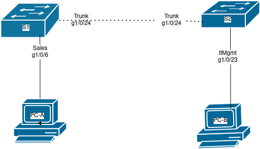
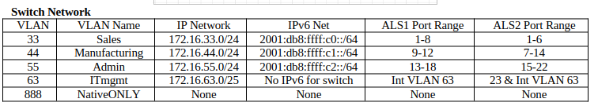
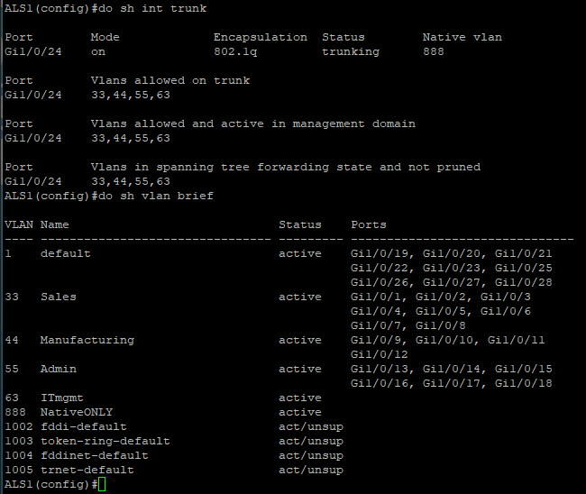
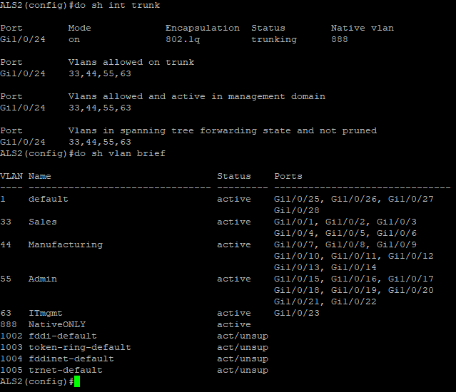

# Vlan procedure

## Purpose
Vlans are useful because they allow people to separate traffic into different isolated groups on the same switch, reducing the need for 
multiple switches. Vlan trunking allows traffic from multiple vlans to cross a single eithernet cable while remaining logically isolated.
This saves a lot of space, time and money. Instead of running eight cables across a building for eight separate networks, one can simply
use a single vlan trunk.


## New Commands


New Command | what it does
------------|-------------
vlan 33 | creates or edits a vlan
(config-vlan)# name bleh | names a vlan bleh
(config-if)switchport trunk encapsulation dot1q | sets the trunk mode to the modern 802.1q.
(config-if)switchport nonegotiate | disables the trunk mode legacy ISL compatability
(config-if)switchport mode trunk | sets the interface as a trunk, doesn't work on layer 3 switch
(config-if)switchport mode access | edits what the switchport has access to
(config-if)switchport access vlan 33 | Allows the interface to access vlan 33
(config-if)switchport trunk allowed vlan 33,44,55,63 | allow vlans to cross the trunk link
(config-if)switchport trunk native vlan 888 | sets the native vlan
do sh int trunk | shows useful information about the trunk
do sh vlan brief | shows useful information about the vlans


## Procedure
1. Attach eithernet cables to the switches based on the following network diagram.





</br>

2. Run the universal configuration commands found in the [base configuraion procedural document](cisco-base-config.md) on both switches
3. Create all of the vlans:
- a. Create a vlan: **vlan 33**
- b. Assign it a name: **name Sales**
- c. Repeat these steps until all of the vlans are created
4. Assign ports to all of the vlans
- a. Select which ports will bed edited: **int range g1/0/1-6**
- b. Edit what the ports have  access to: **switchport mode access**
- c. Place the ports onto the vlan: **switchport access vlan 33**
- d. Start all of the interfaces so that they are running: **no shut**
- e. Repeat these steps until every vlan has access to the correct ports
5. Trunking
- a. Select which interface will be the trunk: **int g1/0/24**
- b. Disable DTP mode for security: **switchport nonegotiate**
- c. Place the port into trunk mode: **switchport mode trunk**
- d. Allow secure vlans to cross the trunk: **switchport trunk allowed vlan 33,44,55,63**
- e. Set our insecure native vlan: **switchport trunk native vlan 888**
- f. Enable the trunk interface: **no shut**
6. Configure the management vlan
- a. Select the management vlan: **int vlan 63**
- b. Assign it an ip for ssh later: **ip add 172.16.63.5 255.255.255.128**
- c. Give it a useful description: **desc ITmgmt**
- d. Enable the interface: **no shut**
7. Configure S2, and it's unique access to management
- a. Repeat steps 1 - 6 on the second switch
- b. Select an interface for management: **int g1/0/23**
- c. Edit what the interface has access to: **switchport mode access**
- d. Allow access to the management vlan: **switchport access vlan 63**

## Verification and Troubleshooting
1. Verify S1 is configured correctly
- a. Verify trunk configuration: **do sh int trunk**
- b. Verify vlan configuration: **do sh vlan brief**
- c. Ensure that your configuration matches the image below


2. Verify S2 is configured correctly
- a. Verify trunk configuration: **do sh int trunk**
- b. Verify vlan configuration: **do sh vlan brief**
- c. Ensure that your configuration matches the image below


<details> <summary>Script</summary>


```
! ===============================
! This is switch 1 config
en
config t
hostname ALS1
no ip domain-lookup
line con 0
password cisco
login
logging sync
exec-time 120 0
enable secret class
service password-encryption
ip domain name challenge.local
crypto key generate rsa
1024
ip ssh ver 2
username student secret cisco 
username admin priv 15 secret cisco line vty 0 15 transport input ssh
login local
banner motd % keep out %
ip default-gateway 172.16.1.0 255.255.255.0
vlan 33
name Sales
exit
vlan 44
name Manufacturing
exit
vlan 55
name Admin
exit
vlan 63
name ITmgmt
exit
vlan 888
name NativeONLY
exit
int range g1/0/1-8
switchport mode access
switchport access vlan 33
no shut
exit
int range g1/0/9-12
switchport mode access
switchport access vlan 44
no shut
exit
int range g1/0/13-18
switchport mode access
switchport access vlan 55
no shut
exit
int vlan 63
ip add 172.16.63.5 255.255.255.128
desc ITmgmt
no shut
exit
int g1/0/24
!switchport trunk encapsulation dot1q
switchport nonegotiate
switchport mode trunk
switchport trunk allowed vlan 33,44,55,63
switchport trunk native vlan 888
no shut
exit
!copy run start
!show arp
!show run


! ===============================
! This is switch 2 config
en
config t
hostname ALS2
no ip domain-lookup
line con 0
password cisco
login
logging sync
exec-time 120 0
enable secret class
service password-encryption
ip domain name challenge.local
crypto key generate rsa
1024
ip ssh ver 2
username student secret cisco 
username admin priv 15 secret cisco
line vty 0 15
transport input ssh
login local
banner motd % keep out %
ip default-gateway 172.16.1.0 255.255.255.0
vlan 33
name Sales
exit
vlan 44
name Manufacturing
exit
vlan 55
name Admin
exit
vlan 63
name ITmgmt
exit
vlan 888
name NativeONLY
exit
int range g1/0/1-6
switchport mode access
switchport access vlan 33
no shut
exit
int range g1/0/7-14
switchport mode access
switchport access vlan 44
no shut
exit
int range g1/0/15-22
switchport mode access
switchport access vlan 55
no shut
exit
int vlan 63
ip add 172.16.63.6 255.255.255.128
desc ITmgmt
no shut
exit
int g1/0/23
switchport mode access
switchport access vlan 63
no shut
int g1/0/24
!switchport trunk encapsulation dot1q
switchport nonegotiate
switchport mode trunk
switchport trunk allowed vlan 33,44,55,63
switchport trunk native vlan 888
no shut
exit
!sh ip trunk brief
!sh vlan brief
!copy run start
!show arp
!show run
```

</summary> </details>
