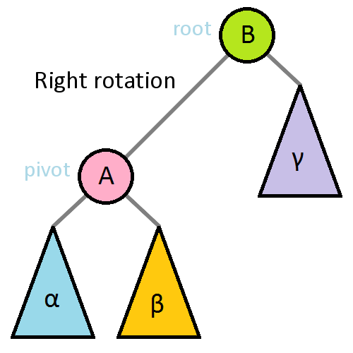

- [dsa](dsa.md)
- [gralphs](gralphs.md)

<details> <summary>Trees</summary>


standard binary search trees can:
1. search O(n) and $\Omega (\log(n))$
2. insert O(n) and $\Omega (\log (n))$
3. delete O(n) and $\Omega (\log (n))$

- NOTE:
    - regular binary trees are not efficent
    - Self balencing trees are better

Each node can hold:
1. from zero to multiple pointers
2. data


#### Binary Search Trees
- A node with no children is called a leaf node
- As the computer decends down the tree it compares the target value to each parent node </br>
if the target value is greater than the parent's key value it points to right child node 
- Left's key value $\leq$ parent's key value < right's key value
- Time complexity o(H) where H is the height of the tree
- Height is on average o(Log N).


</summary> </details>


<details> <summary>AVL Trees</summary>

- Self balencing binary trees
- Actively ensures height cannot exceed log(n)
- Lookups are faster than red/black trees

- The height of a node is the maximum distance from a leaf
- The balence of a node depends on its children
    - Balence = left.height - right.height
    - Every node on a balenced tree has:  $-1 \le balence \le 1$
    - If a node breaks this rule the tree is unbalenced
    - A tree will rotate unbalenced nodes to fix this 



</summary> </details>


<details> <summary>Red/Black Trees</summary>


- turn linked lists into search trees

</summary> </details>


<details> <summary>Heap</summary>

- Also known as priority queue
- Abstract data type where elements have priority
- higher priority elements served first
- most of the heap is only semi sorted
- searching through the heap is O(N) time complexity
- inserting takes O(log n) time

## min heaps 
- the smallest element will always be at the top

Adding nodes:
- new nodes attempt to attach to the first available parent (top to bottom left to right)
- once attached the node compares itself to it's parent. If smaller it will "bubble up", </br>
swapping places with it's parent until it's either at the top, or it's parent is smaller.


Removing nodes:
- if the top node is removed, the newest leaf node will be placed on top. Then it (former newest leaf) will bubble </br>
down the tree, comparing itself to both children until both children are smaller


</summary> </details>


<details> <summary>Depth First Search</summary>

Time complexity O(V + E) 

Datastructures
- int level[v] stores the distance from the root
- boolean closed[] stores which vertex are closed
- Heavily uses a stack datastructure
    - Add each visited node to a stack
        - To backtrack just pop off the stack


Intuition
1. Pick a route
2. Keep going until you
    - Reach a dead end
    - Visit a previously visited node
3. Backtrack to the last node that has unvisited neighbors


- One branch at a time
```python
n = ##number of nodes
g = ##adacency list representing the gralph
def dfs(at):
    if visited[at]:
        return
    else
        visited[at] = true
        neighbors = gralph[at]
        for next in neighbors:
            dfs(next)


## This starts the search
start_node = 0
dfs(start_node)

```

</summary> </details>


<details> <summary>Bredth First Search</summary>


- One level at a time
- Datastructures involved
    - Add each visited node to a queue as you visit them
        - To 

1. Add current node to the queue
2. Add any unvisited neighbords to the queue

```python

input = ### an undirected connect gralph G. rooted at v1
output = ## a breadth-first search tree

def breadthFirstSearch (Gralph, root):
    for node in Gralph:
        n.distance = INFINITY
        n.parent = nil

        


```


</summary> </details>


<details> <summary>Topological</summary>

A topological ordering is:
- A walk which must occur in a specific order
- Used for installing program dependencies (it's how gradle works!)
- Example: getting dressed
    - underwear ->  pants ->  socks -> shoes
    - socks -> underwear -> pants -> shoes
        - The order of underwear and pants matters
        - The order of socks and shoes matters
        - The order of shoes and pants matters


#### Top Sort ####
Time complexity: O(V + E) 
1. Pick an unvisited node to start at
2. Do a depth first search on this node
    - Only explore unvisited nodes
3. On the recurseive callback fo the DFS
    - Add the current node to the topological ordering
    - Do this in reverse order


```
def topSort(gralph):
n = gralph.numberOfNodes()
V= []
ordering[n]
i = n - 1


```

#### Kahn's Algorithm ####
- Only applicable in directed gralphs
    - Specifically directed Acyclic Grlaph
        - This means no directed cycles
- Uses a queue to manage the topological ordering
- Uses an array to track the in-degree of each node
- NOTE: A dependency is anything on the pointy end of an arrow


1. Repeatedly remove nodes without any dependencies.
2. Add these removed nodes to the topological ordering
3. When a node is gone, its edges delete too
    - Change the in/out degrees of neighbor nodes to reflect this
4. Stop removing nodes when you run out of nodes, or create a cycle

</summary> </details>


<details> <summary>Dijkstra</summary>


- Shortest path algorithm for weighted gralphs, allows cycles
- Input: Starting node start
- Output: Shortest path from start to every other node


Datastructures
- uses a min-heaps AKA priority queue
    - Use a fibanocci heap for best performance
- Use an array dist[n] to store distances
- Use boolean array closed[n] to store closed edges
- use int[n] dist to store distance from start to destination node


1. Update estimates
- explore all unexplored nodes connected to current node
    - Why? because we must visit each node to know it's edge weight
    - Each explored node is added to the min heap?
    - Each explored node is "relaxed" when it is added to the min-heap?
2. Close the current node by adding it to "closed"
3. Choose the next vertex to explore
    - Go to the unexplored node with the smallest estimate
    - Repeat these steps from the beginning


</summary> </details>

<details> <summary>UnionFind</summary>

Datastructures
- Augmented LinkedList
    - each node points to the "represenative" element of the set
    - each node also points to the next item (non rep) element

UNION(setX, setY)
- Merge the smaller of the two sets into the larger one
- when smaller becomes part of larger, it's rep changes

FIND(element)
- Returns the represenative of the element

MAKESET(element)
- Creats a new set with represenative "element"

</summary> </details>


<details> <summary>Kruskals Algorithm</summary>

Input: An undirected weighted graph
Outputs: Mminimum spanning tree.

Datastructures usesd
- UnionFind

To find the number of edges processed by Kruskals
1. Make a minimum spanning tree
2. Order the edges smallest to biggest
3. Find the largest node in the MST, call it max
4. Every edge less than max is processed


</summary> </details>


