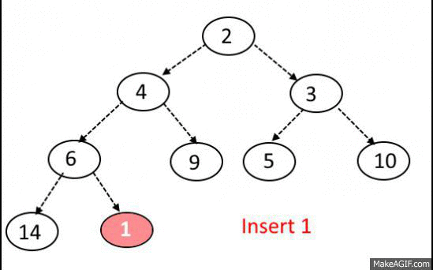
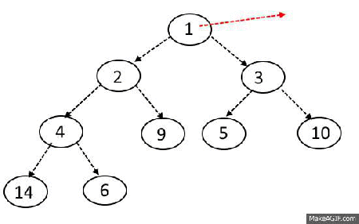

# Datastructures

<details> <summary>Trees</summary>

Each node can hold:
1. from zero to multiple pointers
2. data


#### Binary Search Trees
- A node with no children is called a leaf node
- The parent node can be reffered to as the 'root' node 
- As the computer decends down the tree it compares the target value to each parent node </br>
if the target value is greater than the parent's key value it points to right child node 
- Left's key value $\leq$ parent's key value < right's key value
- Time complexity o(H) where H is the height of the tree
- Height is on average o(Log N).

bianary search trees can:
1. search
2. insert
3. delete

Self balencing bianary search trees
- red/black trees
- turn linked lists into search trees

</summary> </details>


<details> <summary>Heap</summary>

- Also known as priority queue
- Abstract data type where elements have priority
- higher priority elements served first
- most of the heap is only semi sorted
- searching through the heap is O(N) time complexity
- inserting takes O(log n) time

## min heaps 
- the smallest element will always be at the top

Adding nodes:
- new nodes attempt to attach to the first available parent (top to bottom left to right)
- once attached the node compares itself to it's parent. If smaller it will "bubble up", </br>
swapping places with it's parent until it's either at the top, or it's parent is smaller.



Removing nodes:
- if the top node is removed, the newest leaf node will be placed on top. Then it (former newest leaf) will bubble </br>
down the tree, comparing itself to both children until both children are smaller




</summary> </details>


<details> <summary>lists</summary>


#### Linked lists ####

each memory address stores the address of the next address.


#### Doubly linked lists  ####
each memory address stores the address of the next AND previous address


</summary> </details>


# Algorythms


<details> <summary>Binary search</summary>


- find element within sorted list
- cuts list in half repeatedly
- this example starts at zero

```python

def binary_search(arr, target):
    start = 0 
    end = len(arr) - 1                 #subtraction is done cause indexing starts at zero
    while start <= end:
        mid = (start + end) // 2       #Floor divison rounds quotient down to whole number
        if target == arr[mid]:
            return mid
        elif target < arr[mid]:
            end = mid - 1
        else:
            start = mid + 1
    return -1
    
```

</summary> </details>


<details> <summary>Depth First Search</summary>


```python
n = ##number of nodes
g = ##adacency list representing the gralph
def dfs(at):
    if visited[at]:
        return
    else
        visited[at] = true
        neighbors = gralph[at]
        for next in neighbors:
            dfs(next)


## This starts the search
start_node = 0
dfs(start_node)

```

</summary> </details>


<details> <summary>Bredth First Search</summary>

```

input = ### an undirected connect gralph G. rooted at v1
output = ## a breadth-first search tree

def breadthFirstSearch (Gralph, root):
    for node in Gralph:
        n.distance = INFINITY
        n.parent = nil

        


```


</summary> </details>


<details> <summary>Selection sort</summary>


</summary> </details>


<details> <summary>Insertion sort</summary>

1. Create two piles, sorted and unsorted
2. pull elements out of the unsorted
3. place them into the correct position within the sorted


</summary> </details>


<details> <summary>Merge sort</summary>

- Recursive


</summary> </details>


<details> <summary>Algorithms</summary>


- Actions
- Order
- Sequence structure
- Selection structure 
- Iteration structure

</summary> </details>


