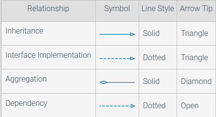

[java](java.md)  

 
Lingo

Modular development - Devide a program into modules or microservices. Test and develop each separately.  

Incremental development - test as you develop. Test constantly.  

Method stub - empty or "abstract" method that does nothing YET. Will eventually do something  

- Substitution principle - Any subclass of an object can be used in place of that object. You can  
    - Example: you can add both cars and planes to the vehicle array.

 

 
The heap and the stack

- Methods live in the stack. Newest at the top
- The stack stores frames
- Local varaibles live on the stack
- The stack is part of the JVM's memory
- Reference variables point to the heap
- Completed methods pop out of the stack

- Objects live on the heap
- Instace variables live on the heap
- Unreferenced stuff in the heap goes to the garbage collector

 

 
garbage collection

- if an object isn't being pointed to by a reference like `new exampleObject()` it will be deleted.

- if one object reference is set equal to another they will read from the same spot in ram.

- if a reference is reassigned and the previous object has no reference, it will be deleted.

 

 
UML diagrams

Inheritance - Is a relationship

Aggregation - Has a relationship

Dependency - 

Association 
- A relationship between classes
- one can navigate from objects of one class to objects of the other class
- usually this is done by following object references

Composition: 
- An aggregation relationship
- The aggregated objects do not have an existence independent of the containing object

 

