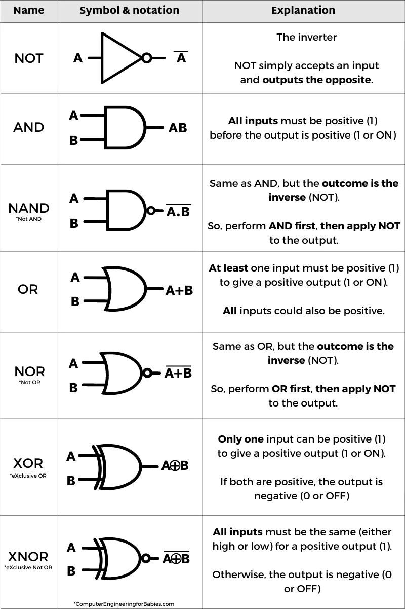

# Logic

[sets](sets.md)  
[index](index.md)

 
Order of operations

1. $\neg$ 
2. $\land$ 
3. $\lor$
4. $\rightarrow$
5. $\leftrightarrow$

 

 
Symbols

- $A \land B == A . B == A \times B == AB$
 $A \oplus B == \lnot AB + \lnot BA$

Symbol | LaTex | meaning
-------|-------|-------
$\land$ | land | logical and
$\forall$ | forall | for every member in set
$\lor$ | lor | logical or
$\oplus$ | oplus | xor
$\exists$ | exists | there exists at least one
$\exists!$ | exists! | there exists only one
$\nexists$ | nexists | there is no

Symbol | LaTex | meaning
-------|-------|-------

  

 

 
Boolean Identities

Name | Identity
-----|---------
Additive | x + 0 x
x.0 = 0 | 
x + 1 = 1
x * 1 = x
x * x = x
x * x = x
x + !x = 1
x * !x = 0

x + yz = (x+y)(x+z)

 

 
Predicate Logic

- Useful for more generalized statements  
P(x): x is an odd number  
P(2) = F  
$\forall x P(x) = F$  

#### Convert english into predicate logic expression
1. Read and try to understand the sentence
2. Find the domain in the statement
3. Find the quantfiers in the statement
4. Rewrite the statement so that the domain and quantifiers are visible
5. Write the statement with variables

 

 
Inference rules

Inference| Another | how to remember
----|--------------|-------------------
Simplification   $p \land q$   $\therefore p$   $\therefore q$| Conjunction   $p$   $q$   $\therefore p \land q$   | Simplification - S for Separate    Conjunction - Conjoin the premesis with $\land$
Modus ponens   $p$    $p \rightarrow q$   $\therefore q$   | Modus tollens   $\neg q$   $p \rightarrow q$   $\therefore \neg p$  
Hypothetical syllogism   $p \rightarrow q$   $q \rightarrow r$   $\therefore p \rightarrow r$   | Disjunctive syllogism   $p \lor q$   $\neg p$   $\therefore q$  
Addition   p   $\therefore p \lor q$   | Resolution   $p \lor q$   $\neg p \lor r$   $\therefore q \lor r$

Type | Generalization | Instantiation
-----|----------------|------
Universal | $\forall x (x \subset y)$   $\therefore (x \subset)$
Existential | $\exists_x S(x)$   s(neptune)

 

Generalized Product Rule  
- In every race someone must come first, second, third, fourth, etc.
- One person cannot occupy two of these positions
- The total number of race orders is N! where N is the number of runners

$$\frac{x_1 \cdot x_2 \cdot x_3 \cdot ... x_n}{n}$$

