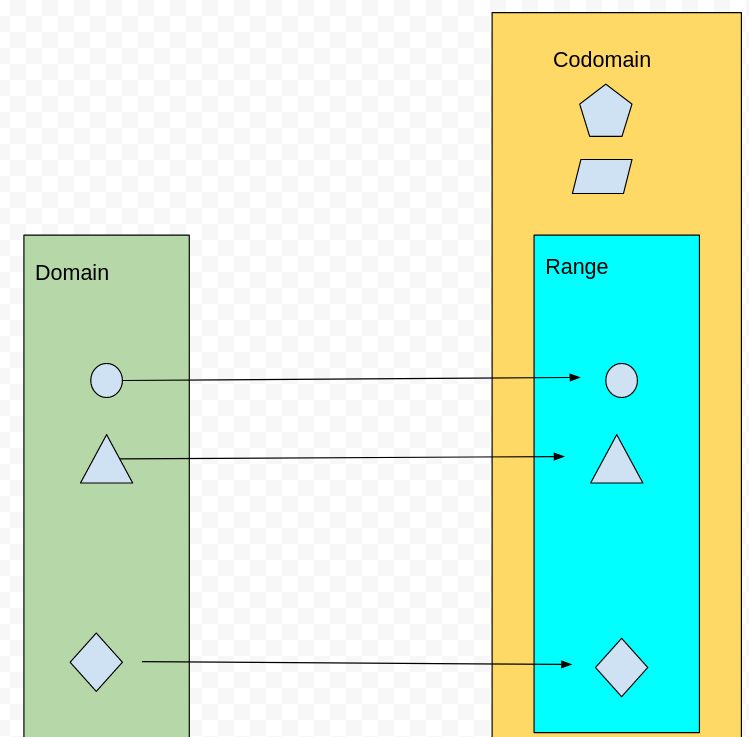
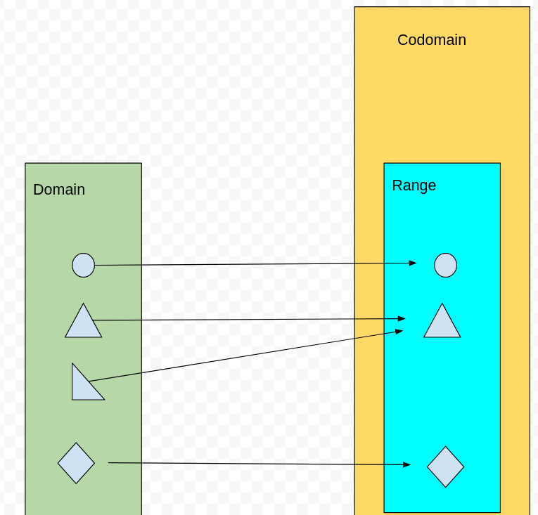

# Sets

[index](index.md)  
[logic](logic.md)  

- Sets are unordered
- Sets contain only unique elements
- Two sets are called a "disjoint" if their intersection contains no values

 
Symbols

Symbol | LaTex | Name
-------|-------|------
$\cup$ | cup | union
$\cap$ | cap | intersection
$\oplus$ | oplus | symmetric difference

Symbol | LaTex | Name
-------|-------|------
$\in$ | in | is member of 
$\ni$ | ni | owns member
$\notin$ | notin | not member of 
$\notni$ | notni | doesn't own member

- |A| means the cardinality of A
A = {2,7,5}  
|A| = 3  

- Absolue compliment for everything in the universe outside A
    - $\bar{A}$ means the absolute compliment of A
    - A' also means "the compliment to A"

- Relative compliment (looks like a backslash)
    - A \ B = B - A
    - This is like a left outer join in SQL
- Symetric difference 
    - like a union excluding any intersecting elements

    
 

 
Laws

name | Identity | Identity
-----|----------|----------
DeMorgans law | $\overline{A \cap B} = \bar{A} \cup \bar{B}$| $\overline{A \cup B} = \bar{A} \cap \bar{B}$
Distributive Laws | $A \cup (A \cap B) \equiv (A \cup B) \cap (A \cup C)$
Associative Laws | $A \cup (B \cup C) \equiv (A \cup B) \cup C$
Absorbtion | $A \cup(A \cap B) \equiv A$

name | Identity | Identity
-----|----------|----------

 

 
Power Sets

- The power set of set 'S' is the set of all subsets of S.
- Notation for power sets is P(S)

 

 
Tuples

- Tuples allow duplicates
- Tuples use regular parenthesis ()
- Tuples are ordered
- Math tuples just like [python tuples](python-arrays.md)  

 

 
Functions

Discrete functions 
- The codomain is often called the "target"
- Domain $\rightarrow$ Range 

#### one to one function
- $|D| \geq |T|$
- Everything in the range maps to something in the domain
- AKA Injective function 

#### onto functions
- $|D| \leq |T|$
- $|R| = |T|$
- Everything in the codomain (target) is also in the range 
- AKA Surjective Functions

Bijections
- $|D| = |T|$
- Both Surjective and Injective
- Every y value has an x
- Every target has a domain
- Reverseable mappings

Composition functions
- Applying a function to the output of another function

 

March 20th DiscStruct quiz  

 
Permutation and Combinations

####
- Both permutations and combinations do not allow repeat elements
- Every element must be distinct

#### Permutation problems involve:
- common notation for permutation is P(n,n)
- ordered(Unlike combinations)
- Arrangement or ordering problems (like anagrams)
- Example: "how many ways to re-arrage the same group"
- $P(n,r) = \frac{n!}{(n-r)!}$

#### Combination problems
- Unordered (DIFFERENT FROM PERMUTATION)
$$\binom{7}{2} = \frac{7!}{2!(7-2)!}$$
$$\binom{n}{p} = \frac{n!}{p!(n-p)!}$$

### Traveling salesman 
Input a list of cities, output them in a specific order. The order of the output is the optimal route which
minimizes the walking distance for the traveling salesman.

#### R-Permutations
$$P(n,r) = n(n-1) ... (n-r + 1)$$
$$P(n,r) = \frac{n!}{(n-r)!}$$
Example "There are 100 people, and three prizes, how many ways can people get prises"  
Solution: $p(100,3) = \frac{100!}{(100-3)!}$  
- This is a permutation because each prize is distinct and ordered

 

 
Inclusion-Exclusion

$$\sum_{p=1}^{n}(-1)^{p-1} \binom{n}{p}(n - p)!$$

$$\binom{1}{n} (n-1)! - \binom{2}{n} (n - 2)!...$$

 

