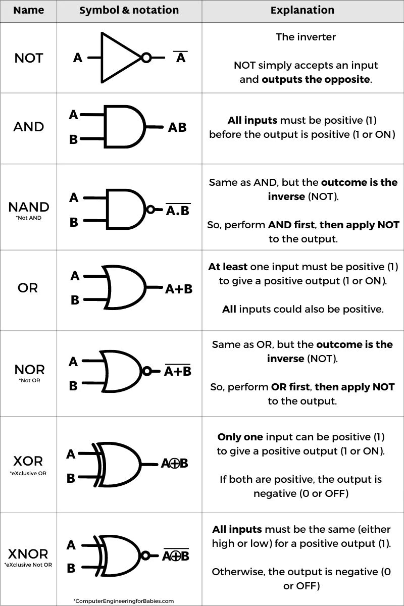

# $\mu arch$
[index](index.md)  
[logic](logic.md)  
[assembly](assembly.md)  

- Resistors are cheap
- Transistors are expensive
- Use less transistors whenever possible

 
Instructions

- Each item in the 'name' column has an opcode

Name | desc | addresses/registers
-----|------|---------------
mov | read RAM location into register X | RAM address
push | write from a register X into a RAM location | RAM address
ADD | add two registers, store the value in the second | two register ID's

 

 
ALU

Uses combinatorial circuts to do math/logic

Inputs
- two registers
- opcode

Outputs
- flags (positive/negative)
- result

 

 
Control Unit

Parts:
- Clock
- instruction register (stores the instruction plucked from memory)
- Address register (stores the memory address where the instruction was found)

What it does:
- Reads from memory addresses in order
- skip to memory address if 'jump' instruction is received

To add/subtract/multiply two numbers, both numbres need to be loaded into registers

 

 
RAM

Populated ram addreses store data with two parts
1. The opcode specifies which instruction/operation the ALU should execute
2. Data that specifies which CPU register or RAM address to perform the instruction on

 

 
Number Systems

Memory addresses are in Hexidecimal

$$1b7e = (1 \times 16^3) + (B \times 16^2) + (7 \times 16^1) +  (e \times 16^0)$$
$$1b7e = (1 \times 16^3) + (11 \times 16^2) + (7 \times 16^1) + (14 \times 16^0)$$

Signed Magnatude Method
- the leftmost bit is the sign
- zero for positive
- one for negative

Dec | twos comp | how?
----|-----------|------
12 | 01100 | 8 + 4
-12 | 11100 | $-1 \times (8 + 4)$

Two's Compliment Metod
- find the inverse of the binary number
- add a one to this inverse
- the result is the two's compliment
- leftmost (most significant) bit holds both a sign and a value

Dec | twos comp | how?
----|-----------|------
12 | 01100 | 8 + 4
-12 | 10100 | -16 + 4

iEEE754

Name | total | sign bits (+,-) | exponent bits | mantissa bits
-----|-------|------------|---------------|---------------
Single (floats in java) | 32 | 1| 8 | 23
Double | 64 | 1 | 11 | 52

 

 
Cryptography

- Public keys are used for encryption
- Secret/private keys used for decryption
- Symetric keys are identical
- C.I.A: Confidenciality, Integrity, Availability

#### RSA keys
- Hashing algroithms
- Message digests (used to verify the ligitimacy of data)
- max packet size 256 bytes

1. Two large prime numbers are generated

2. The product of these primes 'n' is used as the modulus for the keys
- n is semi prime, all it's factors are prime

3. T = (p-1)(q-1)

- public key E
- private key D
- product n
- totient T

$$cipher^{D} mod(n)$$

- Euler's Totient Function

 

 
logic

[logic](logic.md)  

 

 
Karnaugh Maps

- Simplify boolean algebra expressions
- Grey code column/row labels
    - Column labels go in a circle, changing one bit at a time
- draw rectangular groups encircling ones on the table
    - groups must be 2,4,8,16 etc. in size

-|00|01|11|10
-|--|--|--|--
0|

 

